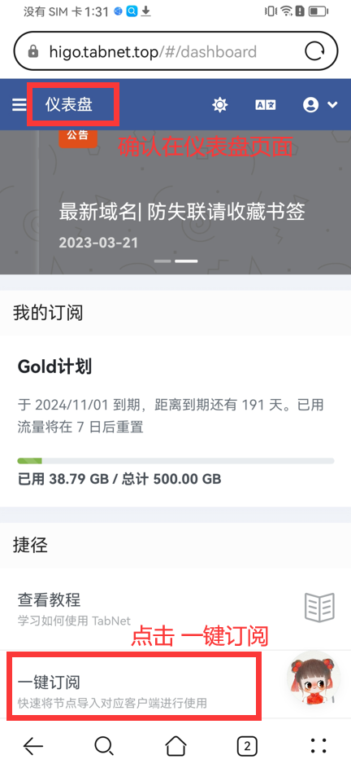
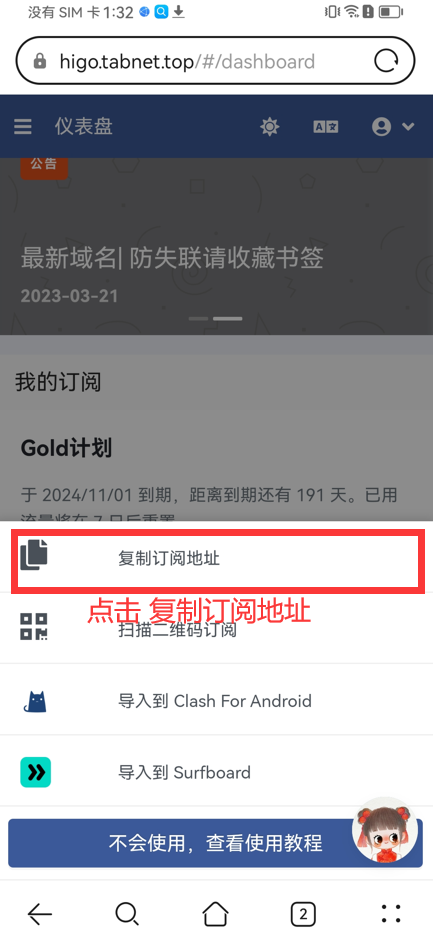

# 📱 Clash for Android 使用教程


**本教程适用于安卓、鸿蒙系统的平板及手机设备**

该客户端仅支持Android 9 以上系统，但是也可能有BUG，不一定兼容市面上所有手机操作系统，如果以下客户端在您的手机系统无法使用，请更换其他安卓APP



请务必确保关闭并后台退出了其他代理软件（shadowsocks、VPN、V2rayN 等），安全软件与【国家反诈中心APP】，所有代理软件都是不能同时使用的且和众多安全软件冲突。


### 软件下载

👉 [大陆网盘下载](https://xmyc.lanzout.com/icZvH13z0mre)（此网盘无需挂代理，大陆网络可以直接打开）

<mark style="color:red;">下载APP后一定要记得安装！！！</mark>

### 导入订阅

打开APP后，点击主页的“配置”

<figure><figcaption>
点击配置
</figcaption></figure>

点击右上角的“➕”号

<figure><figcaption>
点击+号
</figcaption></figure>

点击“从URL导入”

<figure><figcaption>
从URL导入
</figcaption></figure>

回到官网并登录：[https://hi.dmhosts.com](https://hi.dmhosts.com/)

复制订阅地址 如下图

<figure><figcaption>
1.仪表盘首页点击一键订阅
</figcaption></figure> <figure><figcaption>
2.复制订阅地址
</figcaption></figure>

在APP上添加订阅，如下图所示，

1. 名称：输入TabNet；
2. URL：粘贴您拷贝的订阅链接；
3. 自动更新：自动更新订阅的时间填写1440分钟；
4. 点击右上角保存

<figure><figcaption>
请仔细按照步骤操作
</figcaption></figure>

选择加载后的配置，然后返回主界面

<figure><figcaption>
选择配置点返回
</figcaption></figure>

### 开始使用

点击启动，如下图

<figure><figcaption>
点击红框的这一栏标签即为启动
</figcaption></figure>


第一次使用，会弹出连接请求弹窗，一定要点“确定”，点取消将会无法使用


<figure><figcaption>
一定要点确定
</figcaption></figure>

### 切换节点

连接成功后就如下图所示，然后就可以进去代理界面去选择您想使用的节点了

<figure><figcaption>
点击“代理”可以切换节点
</figcaption></figure>

点击“手动切换”选择你需要使用的节点，别按照我教程盲目选择，我这只是示范

<figure><figcaption>
手动选择自己所需节点
</figcaption></figure>

这样试着打开 [www.YouTube.com](http://www.youtube.com/) 测试一下，如果油管可以打开就说明已经成功
