# 📱 Clash for Android 使用教程

## 目录

1. [#shi-yong-jiao-cheng](clash-for-android-shi-yong-jiao-cheng.md#shi-yong-jiao-cheng "mention")
2. [#geng-xin-ding-yue-jiao-cheng](clash-for-android-shi-yong-jiao-cheng.md#geng-xin-ding-yue-jiao-cheng "mention")
3. [#zhong-zhi-pei-zhi-jiao-cheng](clash-for-android-shi-yong-jiao-cheng.md#zhong-zhi-pei-zhi-jiao-cheng "mention")
4. [#kai-qi-quan-ju-dai-li-mo-shi](clash-for-android-shi-yong-jiao-cheng.md#kai-qi-quan-ju-dai-li-mo-shi "mention")&#x20;


点击上方目录即可跳转


***

## 使用教程


请务必确保关闭并后台退出了其他代理软件（shadowsocks、VPN、V2rayN 等），安全软件与【国家反诈中心APP】，所有代理软件都是不能同时使用的且和众多安全软件冲突。


### 1. 系统要求

* **适用于安卓、鸿蒙系统的平板及手机设备**
* 仅支持 **Android 9 及以上版本**
* 部分机型可能存在兼容性问题，如无法使用，请尝试更换其他 Android 客户端

### 2. 应用下载

以下网盘无需挂代理，大陆网络可以直接打开


[网盘下载01](https://tagcloud.lanzouw.com/iokrd2hcglmb)

[网盘下载02](https://share.feijipan.com/s/cjDro9sD)

[网盘下载03](https://yunkeyso.oss-cn-hongkong.aliyuncs.com/khd/yd/yd-clash-anz.zip)



下载完成后，请手动安装 APK 文件。


### 3. 导入订阅

回到官网并登录：[https://hi.dmhosts.com](https://hi.dmhosts.com/)

Clash 支持两种方式导入订阅  [#shou-dong-dao-ru](clash-for-android-shi-yong-jiao-cheng.md#shou-dong-dao-ru "mention") 和 [#yi-jian-dao-ru](clash-for-android-shi-yong-jiao-cheng.md#yi-jian-dao-ru "mention")

#### 🔹 手动导入

1. 复制订阅地址 如下图

<figure><figcaption></figcaption></figure> <figure><figcaption></figcaption></figure>

2. 打开APP后，点击主页的“配置”

<figure>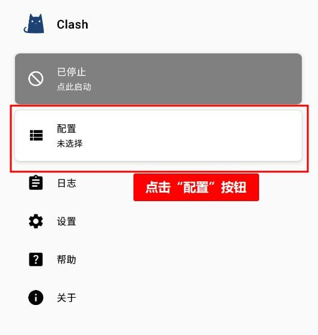<figcaption>
点击配置
</figcaption></figure>

3. 点击右上角的“➕”号

<figure>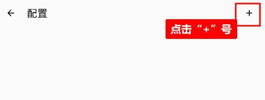<figcaption>
点击+号
</figcaption></figure>

4. 点击“从URL导入”

<figure>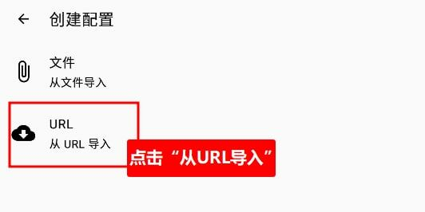<figcaption>
从URL导入
</figcaption></figure>

5. 在APP上添加订阅，如下图所示，
   1. 名称：输入TabNet；
   2. URL：粘贴您拷贝的订阅链接；
   3. 自动更新：自动更新订阅的时间填写1440分钟；
   4. 点击右上角保存

<figure>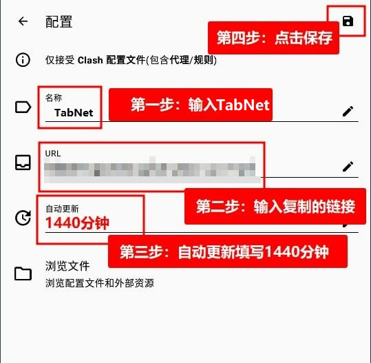<figcaption>
请仔细按照步骤操作
</figcaption></figure>

6. 选择加载后的配置，然后返回主界面

<figure>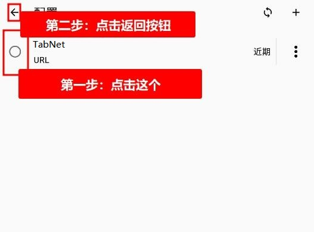<figcaption>
选择配置点返回
</figcaption></figure>

#### 🔹 一键导入

点击下方图片的选项即可自动跳转clash，并重复上方的步骤5和6

<figure>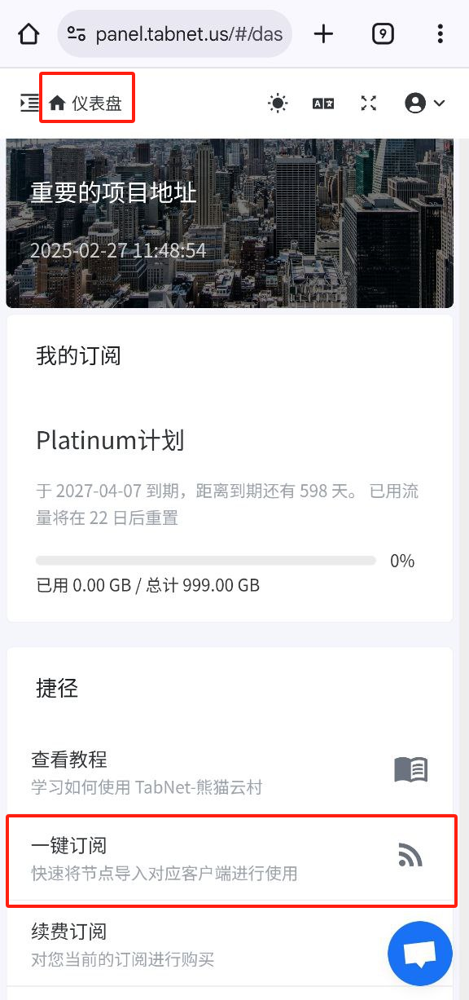<figcaption></figcaption></figure> <figure>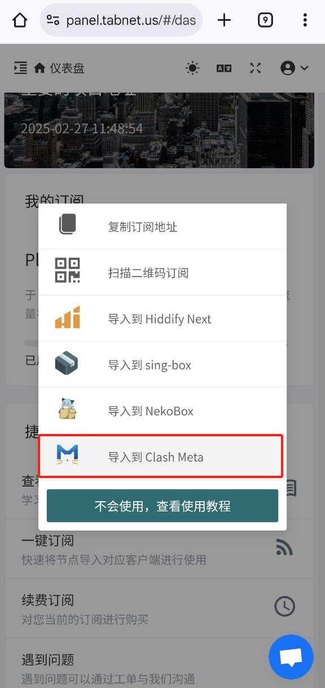<figcaption></figcaption></figure>

### 4. 开始使用

点击启动，如下图

<figure>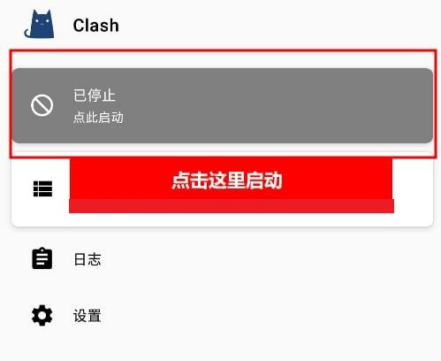<figcaption>
点击红框的这一栏标签即为启动
</figcaption></figure>


第一次使用，会弹出连接请求弹窗，一定要点“确定”，点取消将会无法使用


<figure>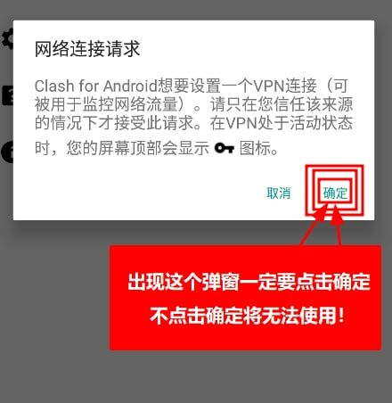<figcaption>
一定要点确定
</figcaption></figure>

### 5. 切换节点

连接成功后就如下图所示，然后就可以进去代理界面去选择您想使用的节点了

<figure>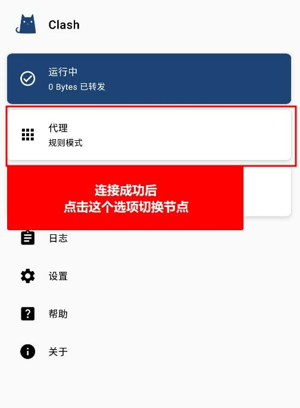<figcaption>
点击“代理”可以切换节点
</figcaption></figure>

点击“手动切换”选择你需要使用的节点，别按照我教程盲目选择，我这只是示范

<figure>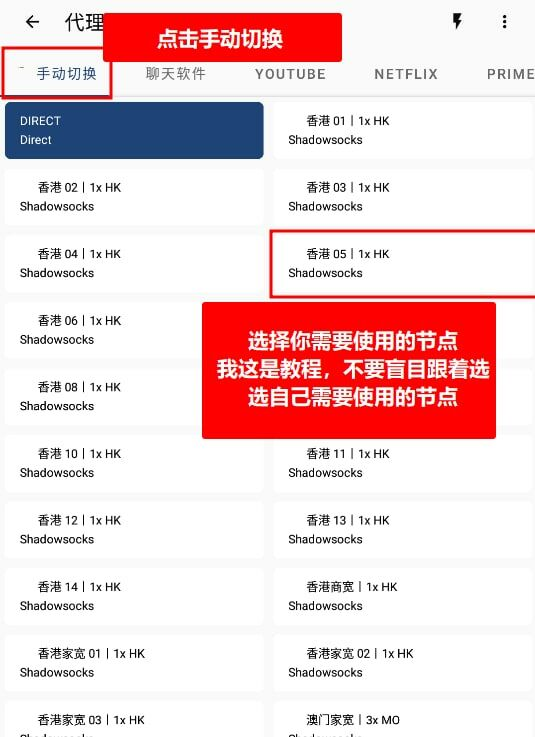<figcaption>
手动选择自己所需节点
</figcaption></figure>

### 6. 测试连接

这样试着打开 [www.YouTube.com](http://www.youtube.com/) 测试一下，如果油管可以打开就说明已经成功

***

## 更新订阅教程


按照下方教程的操作即可实现手动更新订阅，获取最新节点


1. 确保当前处于 **未连接状态**


更新订阅时一定要是未连接状态，如果是链接状态可能会更新失败


<figure>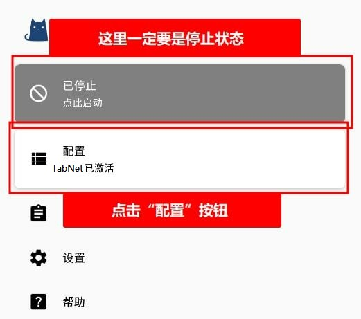<figcaption>
一定要是停止状态
</figcaption></figure>

2. 打开 Clash 界面，进入 **「配置（Profiles）」** 页面
3. 找到需要更新的配置文件，点击右侧的 **刷新按钮** 更新订阅

<figure>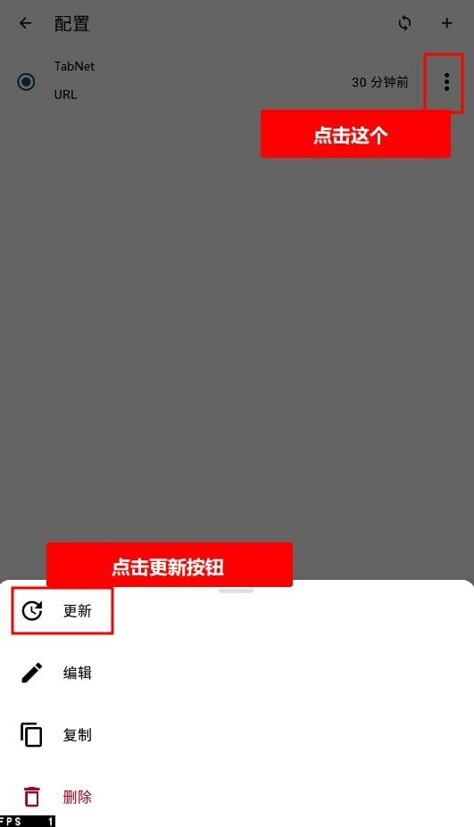<figcaption>
请仔细按教程操作
</figcaption></figure>

***

## 重置配置教程


按照下方教程的操作即可实现手动更新订阅，获取最新节点


1. 确保当前处于 **未连接状态**


更新订阅时一定要是未连接状态，如果是链接状态可能会更新失败


<figure><figcaption>
一定要是停止状态
</figcaption></figure>

2. 然后重新导入，参考 [#id-3.-dao-ru-ding-yue](clash-for-android-shi-yong-jiao-cheng.md#id-3.-dao-ru-ding-yue "mention")

***

## 开启全局代理模式

1. 打开 Clash for Android 主界面
2. 点击左侧菜单中的 **「代理（Proxy）」**

<figure>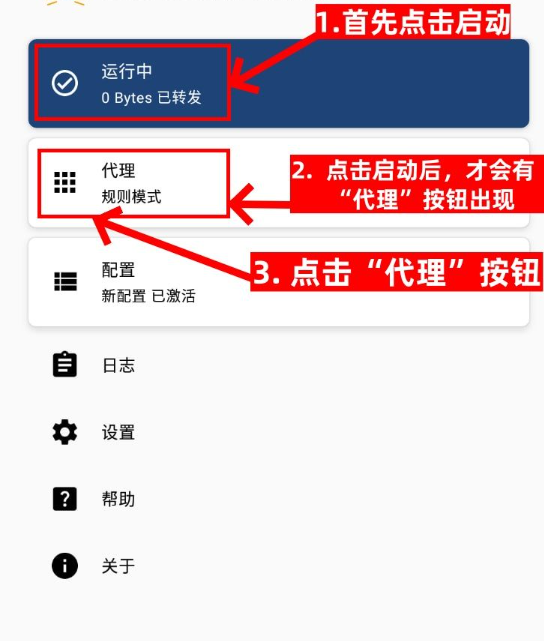<figcaption></figcaption></figure>

3. 在模式切换栏中选择 **「全局（Global）」**

<figure>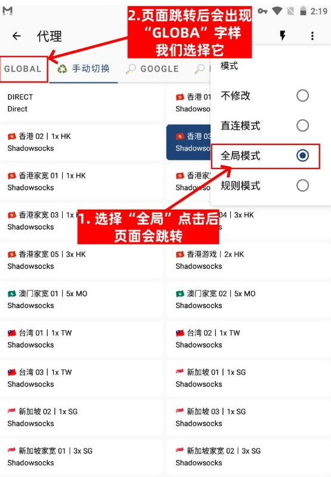<figcaption></figcaption></figure>

4. 从节点列表中选择你需要的代理节点

<figure>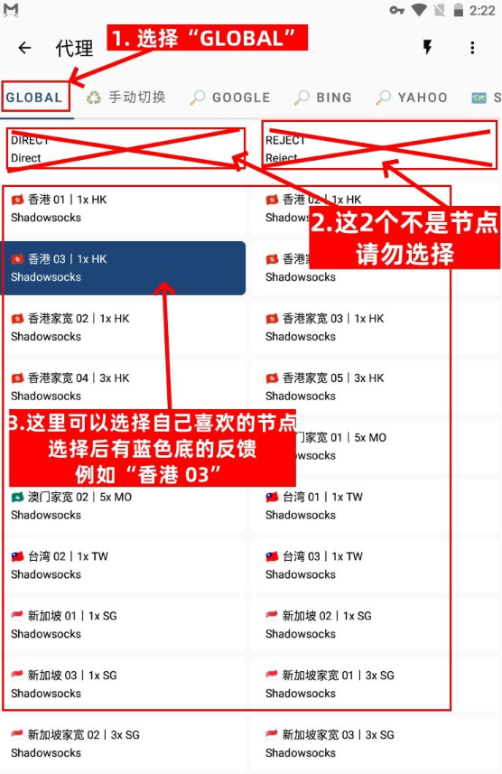<figcaption></figcaption></figure>

5. 返回主页，确认连接成功后，即可实现全局代理

<figure>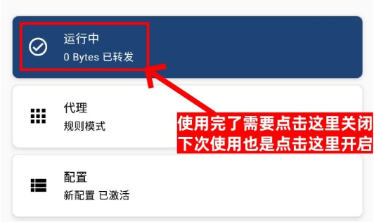<figcaption></figcaption></figure>

### 使用建议

* 建议日常使用 **规则模式**，在需要时切换至 **全局模式**
* 如果全局模式下访问国内网站速度较慢，可以临时切回分流模式
* 切换模式后如遇异常，尝试重新连接或更新订阅
