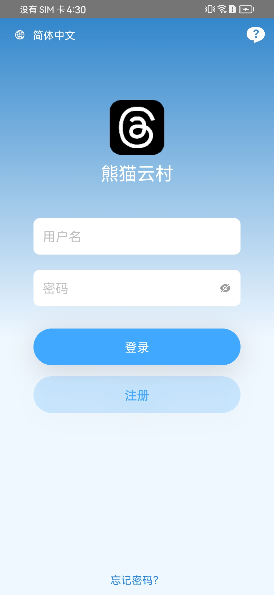
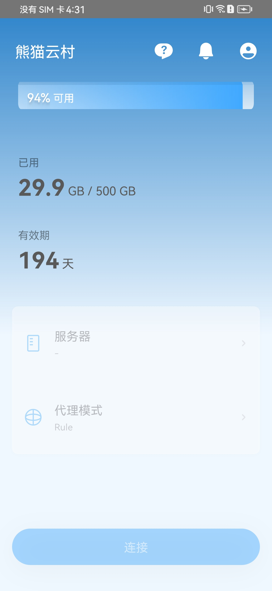
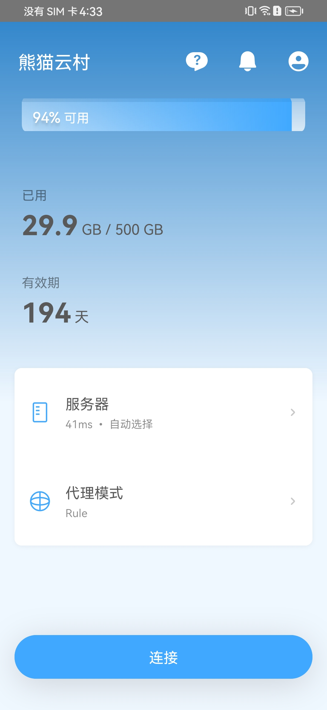
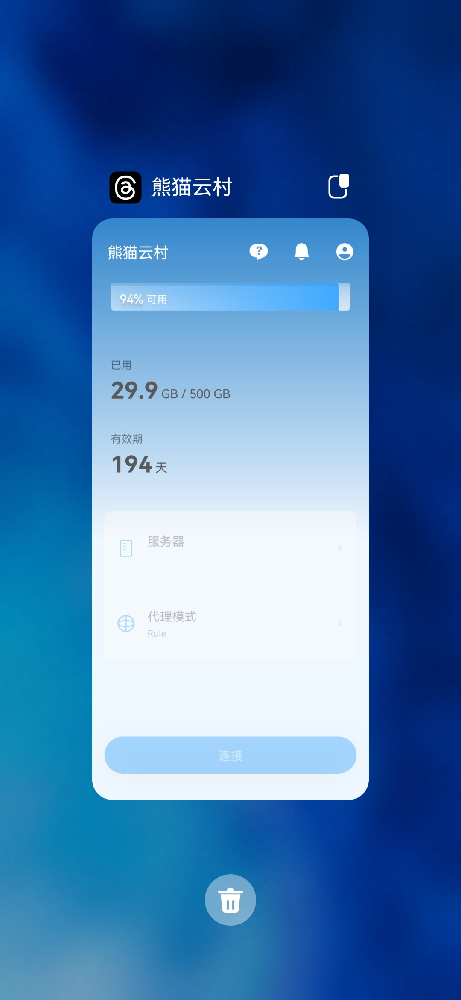
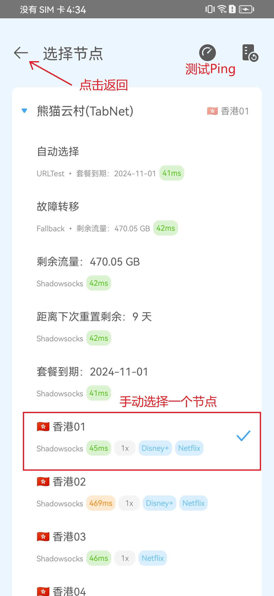
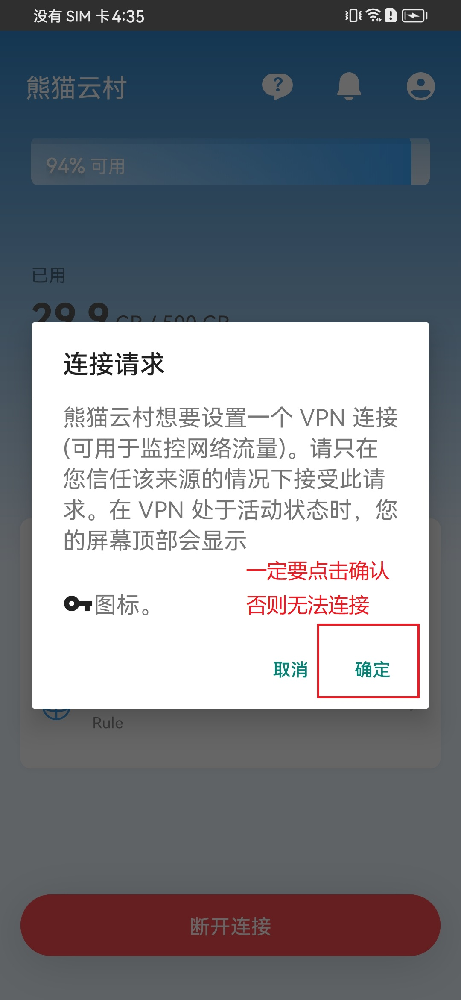

# 📱 TabNet For Android 定制客户端使用教程


**本教程适用于安卓、鸿蒙系统的平板及手机设备**

该客户端仅支持Android 9 以上系统，但是也可能有BUG，不一定兼容市面上所有手机操作系统，如果以下客户端在您的手机系统无法使用，请更换其他安卓APP


## TabNet 客户端下载（新客户端）


安装客户端前 请先 <mark style="color:red;">把手机的安全守护关了</mark> 再安装。否则无法安装。


* 👉[网盘下载](https://wwet.lanzn.com/itZMg2ocf0uj)(蓝奏)
* 👉~~备用网盘下载~~

### 登录界面

输入您在 熊猫云村（TabNet） 注册的邮箱跟密码登录。

<figure><figcaption>
登录界面
</figcaption></figure>

### 开始使用


**tip:** 第一次登录会拉取订阅，有点慢，请耐心等等。<mark style="color:red;">仅第一次登录会这样。</mark>


<figure><figcaption>
第一次登陆时间可能会长一点请耐心等待
</figcaption></figure> <figure><figcaption>
拉完订阅的状态
</figcaption></figure>

如果长时间未刷新出正常节点。请退出软件重新打开。

<figure><figcaption>
退出后台，重新打开app
</figcaption></figure>

### 选择节点

可根据自身需求手动选择节点。


ChatGPT（<mark style="color:red;">香港暂未支持</mark>） 请选择日本、美国、新加坡、韩国等其他国家。


<figure><figcaption></figcaption></figure> <figure><figcaption></figcaption></figure>

### 连接享受

点击<mark style="background-color:green;">连接按钮</mark> 即可享受丝滑的网络体验。

<figure><figcaption>
点击连接按钮
</figcaption></figure> <figure><figcaption>
出现这个连接请求，一定要点确定
</figcaption></figure>

连接后，可以打开 [www.youtube.com](http://www.youtube.com/) 测试一下，如果油管可以打开就说明已经成功
