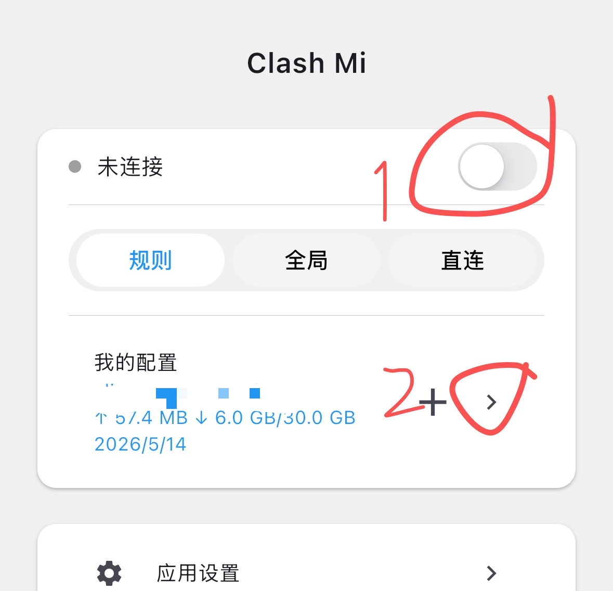
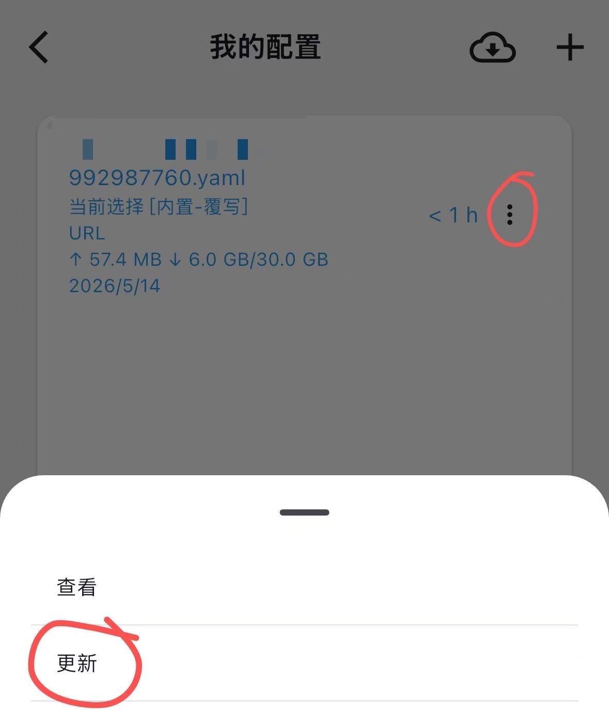
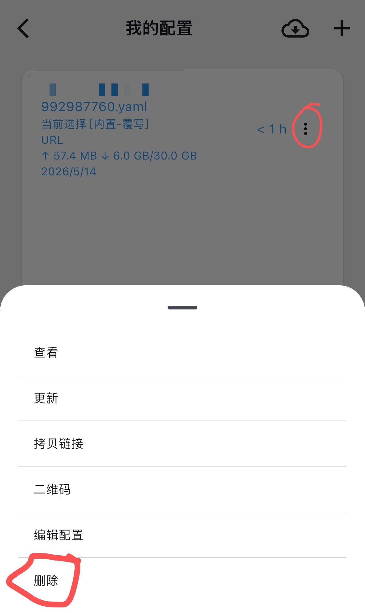

# 📱 Clash Mi 下载与使用

## Clash Mi 使用教程

### 目录

[#shi-yong-jiao-cheng](shadowrocket-xia-zai-yu-shi-yong-1.md#shi-yong-jiao-cheng "mention")

[#geng-xin-ding-yue-jiao-cheng](shadowrocket-xia-zai-yu-shi-yong-1.md#geng-xin-ding-yue-jiao-cheng "mention")

[#chong-xin-pei-zhi-jiao-cheng](shadowrocket-xia-zai-yu-shi-yong-1.md#chong-xin-pei-zhi-jiao-cheng "mention")


点击上方目录即可跳转


***

## 使用教程


**本教程适用于IOS系统的苹果设备.**

请务必确保关闭并后台退出了其他代理软件，所有代理软件都是不能同时使用的。


### 1. 系统要求

* 支持 **iOS 12 及以上版本**
* 低于 iOS 12 的版本无法保证正常使用
* 如为测试版系统，建议降级至最新稳定版

### 2. 风险提示


<mark style="color:red;">**重要安全风险提示：**</mark>

请仅用于登录 **App Store**，下载完成后立即退出

**不要登录 iCloud**，否则可能导致个人资料泄露或设备被锁定， 我们无法帮您恢复损失!!



<mark style="color:red;">**免费共享账号存在安全风险，当前我们已暂停提供(请您谅解)**</mark>，当前我们为您提供购买<mark style="color:purple;">**独享美区ID成品号渠道**</mark>，自动售货地址： [https://shop.moct.cloud/](https://shop.moct.cloud/buy/2)


***

### 3. 正确登录Apple ID


注意！请按教程操作<mark style="color:red;">不要登录icloud</mark>，仅<mark style="color:green;">切换App Store商店ID</mark>即可（否则容易锁ID或锁设备）


打开应用商店（<mark style="color:red;">APP Store</mark>）如下图所示：

<figure><figcaption>
请一定安装图示操作
</figcaption></figure>

### 4. 下载Clash Mi（猫咪）

进商店搜索：<mark style="color:green;">Clash Mi</mark> 图标是一个猫咪的LOGO，别下错了

<figure><figcaption></figcaption></figure>

***

### 5. 导入订阅

回到官网并登录：[https://hi.dmhosts.com](https://hi.dmhosts.com/)

复制订阅地址 如下图

<figure><figcaption></figcaption></figure>

***

#### 步骤二：打开 Clash Mi

进入「我的配置」，点击右上角「+」

***

#### 步骤三：导入配置

点击「从剪贴板导入」

粘贴您的订阅链接

***

#### 步骤四：导入成功

出现成功提示后即可

返回主页

***

### 6. 连接并选择节点

#### 步骤一：开启连接

点击「启用连接」

> 首次使用需授权 VPN 权限，请点击允许

***

#### 步骤二：选择节点

进入「代理 / Proxies」

选择一个可用节点

 

***

### 6. 代理模式说明

* **全局模式（Global）**：所有流量走代理（简单直接）
* **规则模式（Rule）**：按规则分流（推荐日常使用）

***

### 7. 测试连接

连接成功后，可以通过以下方式测试：

* 打开：https://www.google.com
* 或访问 YouTube 等网站

如果可以正常打开，则说明配置成功 ✅

***

***

## 更新订阅教程


当节点失效时，可手动更新订阅。按照下方教程的操作即可实现手动更新订阅，获取最新节点！


1. 确保处于 **未连接状态**


当如果在连接状态下更新，可能会失败


2. 打开订阅管理，点击更新订阅
3. 如更新失败，请多次尝试

<figure><figcaption>
关闭代理后，
</figcaption></figure> <figure><figcaption>
点更新
</figcaption></figure>

***

## 重新配置教程


此教程教您如何删除旧的节点配置，重新获取新的节点配置！


1. 确保处于 **未连接状态**


当如果在连接状态下更新，可能会失败


2. 删除旧的订阅标签

<figure><figcaption>
关闭代理后，
</figcaption></figure> <figure><figcaption>
点删除
</figcaption></figure>

2. 重新导入订阅，参考 [#id-5.-dao-ru-ding-yue](shadowrocket-xia-zai-yu-shi-yong-1.md#id-5.-dao-ru-ding-yue "mention")
