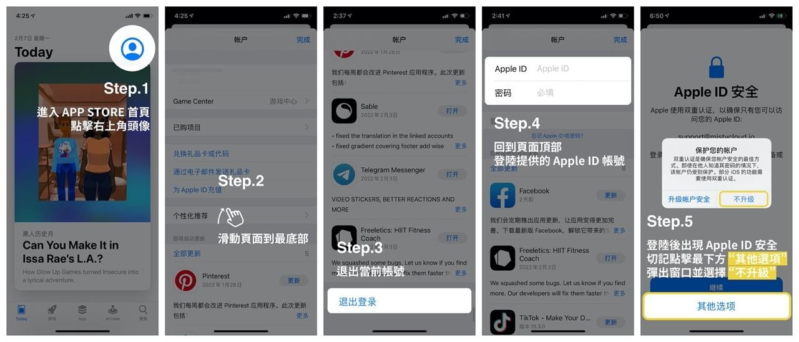
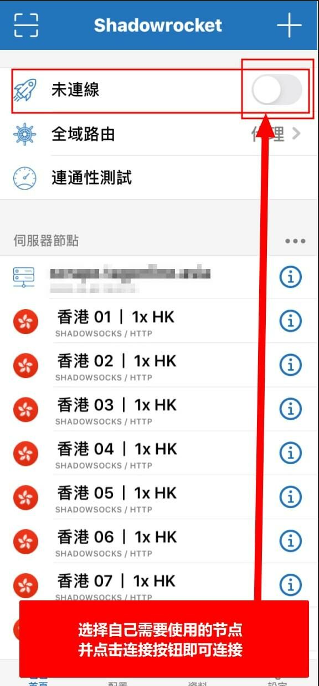
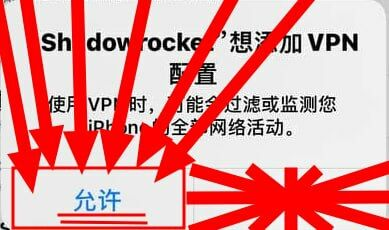
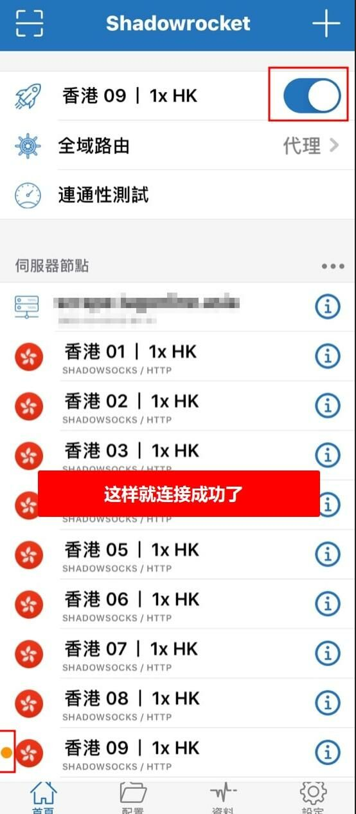
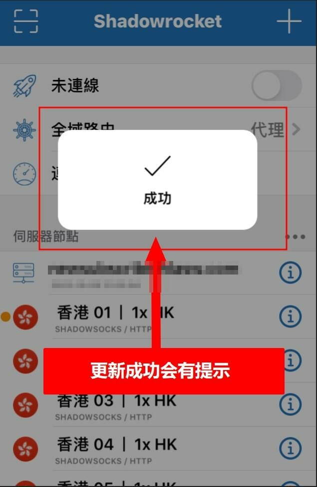

# 📱 Shadowrocket下载与使用

## 目录

[#shi-yong-jiao-cheng](shadowrocket-xia-zai-yu-shi-yong.md#shi-yong-jiao-cheng "mention")

[#geng-xin-ding-yue-jiao-cheng](shadowrocket-xia-zai-yu-shi-yong.md#geng-xin-ding-yue-jiao-cheng "mention")

[#chong-xin-pei-zhi-jiao-cheng](shadowrocket-xia-zai-yu-shi-yong.md#chong-xin-pei-zhi-jiao-cheng "mention")


点击上方目录即可跳转


***

## 使用教程


**本教程适用于IOS系统的苹果设备.**

请务必确保关闭并后台退出了其他代理软件，所有代理软件都是不能同时使用的。


### 1. 系统要求

* 支持 **iOS 12 及以上版本**
* 低于 iOS 12 的版本无法保证正常使用
* 如为测试版系统，建议降级至最新稳定版

### 2. 风险提示


<mark style="color:red;">**重要安全风险提示：**</mark>

请仅用于登录 **App Store**，下载完成后立即退出

**不要登录 iCloud**，否则可能导致个人资料泄露或设备被锁定， 我们无法帮您恢复损失!!



<mark style="color:red;">**免费共享账号存在安全风险，当前我们已暂停提供(请您谅解)**</mark>，当前我们为您提供购买<mark style="color:purple;">**独享美区ID (已购 shadowrocke) 成品号渠道**</mark>，自动售货地址： [https://shop.moct.cloud/buy/2](https://shop.moct.cloud/buy/2)&#x20;


### 3. 正确登录Apple ID


注意！请按教程操作<mark style="color:red;">不要登录icloud</mark>，仅<mark style="color:green;">切换App Store商店ID</mark>即可（否则容易锁ID或锁设备）


打开应用商店（<mark style="color:red;">APP Store</mark>）如下图所示：

<figure><figcaption>
请一定安装图示操作
</figcaption></figure>

### 4. 下载Shadowrocket（小火箭）

进商店搜索：<mark style="color:green;">Shadowrocket</mark> 图标是一个小火箭的LOGO，别下错了

<figure><figcaption>
请仔细检查下载的软件是否正确
</figcaption></figure>

### 5. 导入订阅

回到官网并登录：[https://hi.dmhosts.com](https://hi.dmhosts.com/)

支持两种方式导入订阅  [#shou-dong-dao-ru](shadowrocket-xia-zai-yu-shi-yong.md#shou-dong-dao-ru "mention")和 [#yi-jian-dao-ru](shadowrocket-xia-zai-yu-shi-yong.md#yi-jian-dao-ru "mention")

#### 🔹 手动导入

复制订阅地址 如下图

<figure><figcaption></figcaption></figure>

打开APP后，点击右上角的“➕”号

<figure><figcaption>
点击+号添加订阅
</figcaption></figure>

<figure><figcaption>
请仔细按图示操作
</figcaption></figure>

#### 🔹 一键导入

中下方图片的选项即可自动跳转**小火箭**

<figure><figcaption></figcaption></figure>

### 6. 设置全局路由为代理

设置好后返回到主页，点击“全局路由”

<figure><figcaption>
选择全局路由模式为代理
</figcaption></figure>

选择“代理”

<figure><figcaption>
选择代理模式
</figcaption></figure>

### 7.开启代理连接

返回到主页面就可以选择自己需要的节点了，选择好后点击上面的连接开关

<figure><figcaption>
选择节点后打开代理开关
</figcaption></figure>


<mark style="color:red;">出现弹窗后，点允许，这里不能点其他的，否则将无法使用！！！</mark>


<figure><figcaption>
一定一定一定要允许
</figcaption></figure>

当看到第一个选项变成节点名称，右边的开关点亮后就说明已经成功连接代理了。

<figure><figcaption>
连接成功图示
</figcaption></figure>

### 9. 测试连接

连接后，可以打开 [www.youtube.com](http://www.youtube.com/) 测试一下，如果油管可以打开就说明已经成功

***

## 更新订阅教程


当节点失效时，可手动更新订阅。按照下方教程的操作即可实现手动更新订阅，获取最新节点！


1. 确保处于 **未连接状态**


当如果在连接状态下更新，可能会失败


2. 打开订阅管理，点击 **刷新按钮** 更新订阅
3. 如更新失败，请多次尝试

<figure><figcaption>
关闭代理后，右滑更新
</figcaption></figure> <figure><figcaption>
更新成功提示
</figcaption></figure>

***

## 重新配置教程


此教程教您如何删除旧的节点配置，重新获取新的节点配置！


1. 确保处于 **未连接状态**


当如果在连接状态下更新，可能会失败


2. 删除旧的订阅标签

<figure><figcaption>
代理开关一定要处于关闭状态
</figcaption></figure>

3. 重新导入订阅，参考 [#id-5.-dao-ru-ding-yue](shadowrocket-xia-zai-yu-shi-yong.md#id-5.-dao-ru-ding-yue "mention")
