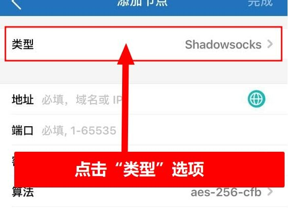
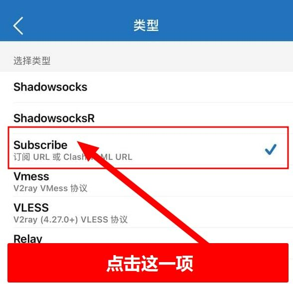

# 📱 Shadowrocket下载与使用


**本教程适用于IOS系统的苹果设备.**

请务必确保关闭并后台退出了其他代理软件，所有代理软件都是不能同时使用的。


### 风险提示


<mark style="color:red;">**重要安全风险提示：**</mark>

请 <mark style="color:red;">**务必**</mark> 严格按照我们的教程步骤登录至 App Store，下载完成后请立即退出，切勿直接登录至您设备的 iCloud，否则可能会导致您的个人资料泄露或者设备被锁定，我们无法帮您恢复损失!!



<mark style="color:red;">**免费共享账号的风险如您无法接受**</mark>，我们也为您提供购买<mark style="color:purple;">**独享美区ID (已购 shadowrocke) 成品号**</mark>，自动售货地址：https://shop.duomi.host/buy/4 有需  求可以去购买。价格为<mark style="color:green;">**35CNY/枚**</mark> 。


### 正确登录Apple ID


注意！请按教程操作<mark style="color:red;">不要登录icloud</mark>，仅<mark style="color:green;">切换App Store商店ID</mark>即可（否则容易锁ID或锁设备）


打开应用商店（<mark style="color:red;">APP Store</mark>）如下图所示：

<figure><figcaption>
请一定安装图示操作
</figcaption></figure>

### 下载Shadowrocket（小火箭）

进商店搜索：<mark style="color:green;">Shadowrocket</mark> 图标是一个小火箭的LOGO，别下错了

<figure><figcaption>
请仔细检查下载的软件是否正确
</figcaption></figure>

### 导入订阅

打开APP后，点击右上角的“➕”号

<figure><figcaption>
点击+号添加订阅
</figcaption></figure>

点击“类型”进去选择

<figure><figcaption>
点击选择类型
</figcaption></figure>

选择“Subscribe”，选择后会自动返回上一页

<figure><figcaption>
选择Subscribe这一项
</figcaption></figure>

回到官网并登录：[https://hi.dmhosts.com](https://hi.dmhosts.com/)

复制订阅地址 如下图

<figure><figcaption>
图一
</figcaption></figure> <figure><figcaption>
图二
</figcaption></figure>

URL那里粘贴你拷贝的订阅链接，备注写：熊猫云村，然后点“保存”就自动返回APP主界面了

<figure><figcaption>
请仔细按图示操作
</figcaption></figure>

### 设置自动更新订阅

返回到主页面后先别着急用，<mark style="color:green;">需要启用自动更新</mark>。先点击设置按钮

<figure><figcaption>
右下角设置按钮
</figcaption></figure>

点击订阅选项

<figure><figcaption>
点击订阅按钮
</figcaption></figure>

开启“打开时更新”与“自动后台更新”两个开关

<figure><figcaption>
打开自动更新开关
</figcaption></figure>

### 设置全局路由为代理

设置好后返回到主页，点击“全局路由”

<figure><figcaption>
选择全局路由模式为代理
</figcaption></figure>

选择“代理”

<figure><figcaption>
选择代理模式
</figcaption></figure>

### 开启代理连接

返回到主页面就可以选择自己需要的节点了，选择好后点击上面的连接开关

<figure><figcaption>
选择节点后打开代理开关
</figcaption></figure>


<mark style="color:red;">出现弹窗后，点允许，这里不能点其他的，否则将无法使用！！！</mark>


<figure><figcaption>
一定一定一定要允许
</figcaption></figure>

当看到第一个选项变成节点名称，右边的开关点亮后就说明已经成功连接代理了。

<figure><figcaption>
连接成功图示
</figcaption></figure>

### 连接享受

连接后，可以打开 [www.YouTube.com](http://www.youtube.com/) 测试一下，如果油管可以打开就说明已经成功


该客户端仅支持iOS12及以上系统。低版本系统不保证能用，如果不能使用，请检查您的iOS版本，如果过旧，请更新至最新的稳定版，如果是测试版请降级到稳定版！

