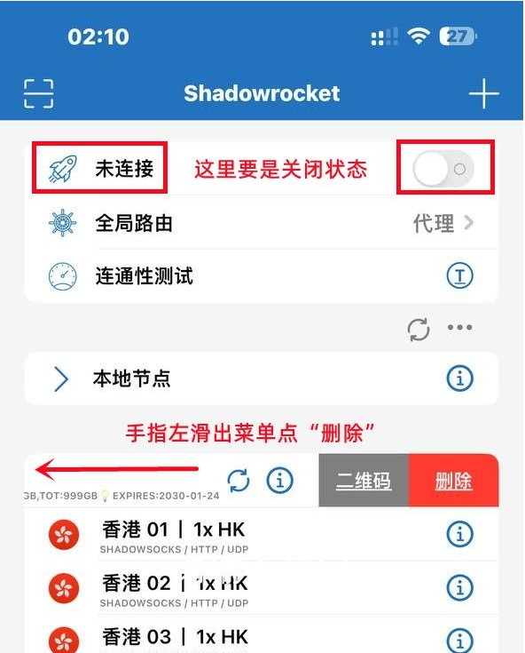

# ♻️ Shadowrocket 重新配置教程


此教程教您如何删除旧的节点配置，重新获取新的节点配置！


一定要在未连接的状态进行操作

<figure><figcaption>
代理开关一定要处于关闭状态
</figcaption></figure>

> 👉 [#dao-ru-ding-yue](shadowrocket-xia-zai-yu-shi-yong.md#dao-ru-ding-yue "mention")重新操作一遍即可。

