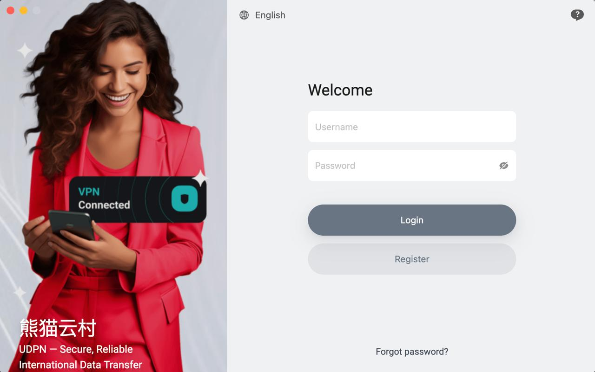
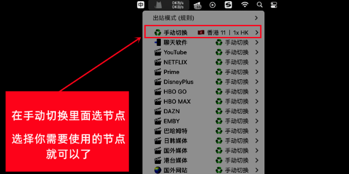
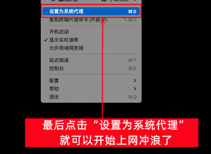
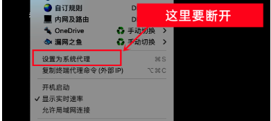

# 🖥️ ClashX For Mac 使用教程

## 目录

1. [#shi-yong-jiao-cheng](clashx-for-mac-shi-yong-jiao-cheng.md#shi-yong-jiao-cheng "mention")
2. [#geng-xin-ding-yue-jiao-cheng](clashx-for-mac-shi-yong-jiao-cheng.md#geng-xin-ding-yue-jiao-cheng "mention")
3. [#zhong-zhi-pei-zhi-jiao-cheng](clashx-for-mac-shi-yong-jiao-cheng.md#zhong-zhi-pei-zhi-jiao-cheng "mention")


点击上方目录即可跳转


***

## 使用教程

### 1. 系统要求


Clash 是一个使用 Go 语言编写，基于规则的跨平台代理软件核心程序。

该客户端仅支持**Mac os** 10 以上系统


### 2. 应用下载

&#x20;网盘下载


[ 网盘下载01](https://tagcloud.lanzouw.com/i0adC2i5em2j)

[ 网盘下载02](https://share.feijipan.com/s/moEUHJ2p)


下载完毕后，我们按照下方图示操作完成安装

<figure><figcaption></figcaption></figure>

### 3. 首次运行


安装完成后，我们在应用程序里面找到ClashX，然后打开它，

1. 如果系统提示不安全，无法打开，我们需要打开一个开启所有来源的开关，具体看教程👉 [mac-os-kai-qi-ren-he-lai-yuan-an-zhuang-quan-xian-jiao-cheng.md](../chang-jian-wen-ti/mac-os-kai-qi-ren-he-lai-yuan-an-zhuang-quan-xian-jiao-cheng.md "mention")
2. 如果能正常打开，请继续往下阅读


1. 开启后打开程序就是这样的，如下图所示

<figure><figcaption></figcaption></figure>

2. 第一次使用，需要安装一个帮助程序，我们点击“安装”

<figure><figcaption></figcaption></figure>

3. 输入您系统密码验证一下即可

<figure><figcaption></figcaption></figure>

### 4. 导入订阅

首先回到 官网并登录：[https://hi.dmhosts.com](https://hi.dmhosts.com/)

Clash 支持两种方式导入订阅  [#shou-dong-dao-ru](clashx-for-mac-shi-yong-jiao-cheng.md#shou-dong-dao-ru "mention") 和 [#yi-jian-dao-ru](clashx-for-mac-shi-yong-jiao-cheng.md#yi-jian-dao-ru "mention")

#### 🔹 手动导入

1. 复制个人订阅地址

<figure><figcaption>
请按照图示操作
</figcaption></figure>

2. 我们在桌面右上角找到一个猫咪图标，右键打开菜单

<figure><figcaption></figcaption></figure>

3. 点击“添加”

<figure><figcaption></figcaption></figure>

4. 我们在ClashX里面添加刚刚复制的订阅，Config Name写Nervix

<figure><figcaption></figcaption></figure>

4. 订阅添加后，如果没有任何错误提示，我们关闭窗口即可

<figure><figcaption></figcaption></figure>


如果下载配置文件出现 **`Network Error`**：

1. 请回到官网刷新页面后重新复制地址（网站提供 3 个可用地址）
2. 或更换网络环境（例如使用手机 4G/5G 热点）


6. 重新点击右上角的猫咪，节点出来后，我们在手动切换里面选择需要使用的节点

<figure><figcaption></figcaption></figure>

7. 点击“设置为系统代理”，即可使用

<figure><figcaption></figcaption></figure>

#### 🔹 一键导入

1. 选中下方图片的选项即可自动跳转到clash，**之后请重复上方的第三步骤，选中新订阅标签**

<figure><figcaption></figcaption></figure>

2. 导入成功的后，重复上方手动导入的第6, 7步骤即可


如果下载配置文件出现 **`Network Error`**：

1. 请回到官网刷新页面后重新复制地址（网站提供 3 个可用地址）
2. 或更换网络环境（例如使用手机 4G/5G 热点）


连接后，可以打开 [www.youtube.com](http://www.youtube.com/) 测试一下，如果油管可以打开就说明已经成功

***

## 更新订阅教程


按照下方教程的操作即可实现手动更新订阅，获取最新节点信息


1. 确保当前处于 **未连接状态**


更新订阅时一定要是未连接状态，如果是链接状态可能会更新失败


2. 找到需要更新的配置文件，点击托管配置，点击更新

<figure><figcaption></figcaption></figure>


如更新失败，请多尝试几次


***

## 重置配置教程


此教程教您如何删除旧的节点配置，重新获取新的节点配置！


1. 确保当前处于 **未连接状态**


先关闭系统代理，如果本身是关闭的就忽略这一步


<figure><figcaption></figcaption></figure>

2. 回到 官网并登录：[https://hi.dmhosts.com](https://hi.dmhosts.com/)复制订阅地址 如下图

<figure><figcaption>
请按照图示操作
</figcaption></figure>

3. 回到 Clash 软件

<figure><figcaption></figcaption></figure>

4. 重新添加新的订阅地址并下载配置文件


如果下载配置文件出现 **`Network Error`**：

1. 请回到官网刷新页面后重新复制地址（网站提供 3 个可用地址）
2. 或更换网络环境（例如使用手机 4G/5G 热点）

