# 🖥️ M系列芯片 Shadowrocket 使用教程

## 目录

[#shi-yong-jiao-cheng](m1-xin-pian-shadowrocket-shi-yong-jiao-cheng.md#shi-yong-jiao-cheng "mention")

[#geng-xin-ding-yue-jiao-cheng](m1-xin-pian-shadowrocket-shi-yong-jiao-cheng.md#geng-xin-ding-yue-jiao-cheng "mention")

[#chong-xin-pei-zhi-jiao-cheng](m1-xin-pian-shadowrocket-shi-yong-jiao-cheng.md#chong-xin-pei-zhi-jiao-cheng "mention")


点击上方目录即可跳转


***

## 使用教程

### 1. 系统要求


**本教程适用于Mac OS 10以上系统，M系列芯片的电脑设备**



请务必确保关闭并后台退出了其他代理软件和360等安全软件，所有代理软件都是不能同时使用的且和众多安全软件冲突。


### 2. 如何确认是否为 M 系列芯片

1. 鼠标点击屏幕左上角 **🍎 Apple 标志**
2. 点击 **「关于本机」**
3. 如果显示为 M1 或 M2 芯片，则支持本教程的应用

<figure>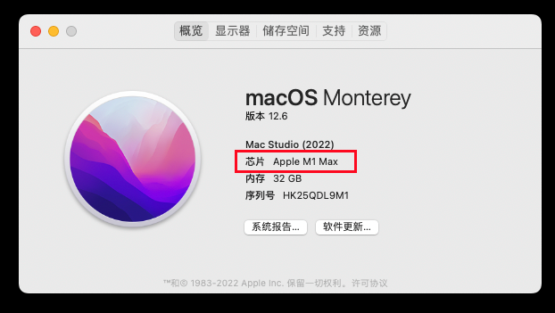<figcaption>
请确认您的电脑是否是M1芯片或者M2芯片
</figcaption></figure>

### 3. 风险提示


<mark style="color:red;">**重要安全风险提示：**</mark>

请仅用于登录 **App Store**，下载完成后立即退出

**不要登录 iCloud**，否则可能导致个人资料泄露或设备被锁定， 我们无法帮您恢复损失!!



<mark style="color:red;">**免费共享账号存在安全风险，当前我们已暂停提供(请您谅解)**</mark>，当前我们为您提供购买<mark style="color:purple;">**独享美区ID (已购 shadowrocke) 成品号渠道**</mark>，自动售货地址： [https://shop.moct.cloud/buy/2](https://shop.moct.cloud/buy/2)&#x20;


### 4. 应用下载

登录账号后，按照下方教程切换账号下载即可。

1. 打开 **Mac App Store**

<figure>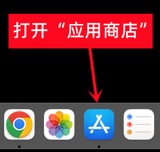<figcaption>
打开App Store
</figcaption></figure>

2. 退出当前 Apple ID

<figure>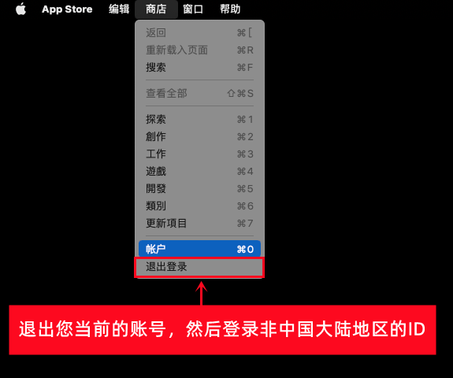<figcaption>
退出自己的账号
</figcaption></figure>

3. 登录已购买 Shadowrocket 的外区 ID
4. 搜索并下载 **Shadowrocket**（图标为 🚀 小火箭，请勿下载错应用）
5. 下载完成后，可切回您自己的 Apple ID

<figure>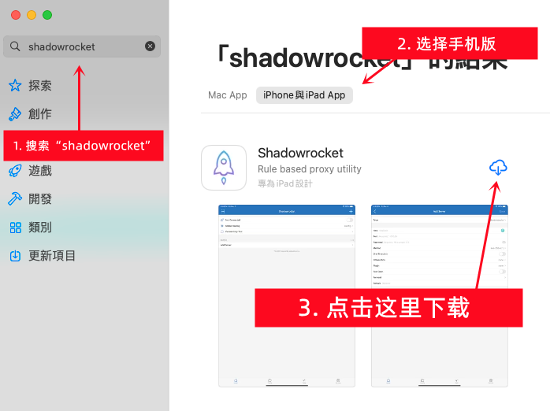<figcaption>
下载 Shadowrocket
</figcaption></figure>

### 5. 打开Shadowrocket

下载好之后我们打开它

<figure>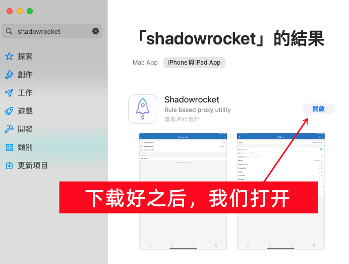<figcaption>
打开Shadowrocket
</figcaption></figure>

### 6. 导入订阅

首先回到 官网并登录：[https://hi.dmhosts.com](https://hi.dmhosts.com/)

复制订阅地址 如下图

<figure><figcaption>
请按照图示操作
</figcaption></figure>

1. 打开APP后，点击右上角的“➕”号

<figure>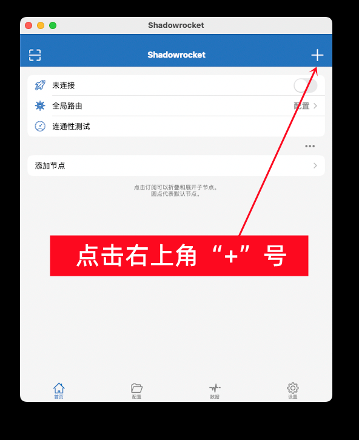<figcaption>
点击+号
</figcaption></figure>

2. 点击“类型”进去选择

<figure>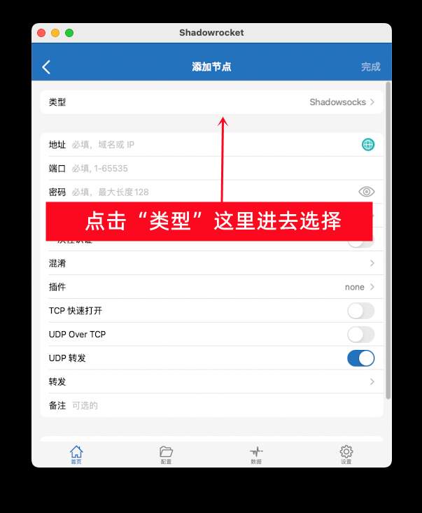<figcaption>
选择类型
</figcaption></figure>

3. 选择“Subscribe”，选择后会自动返回上一页

<figure>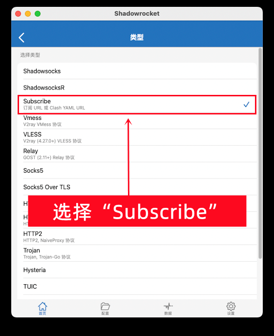<figcaption>
选择 Subscribe
</figcaption></figure>

4. 在 URL 栏粘贴订阅链接
   * 备注填写：`TabNet`
   * 点击 **完成**，自动返回主界面

<figure>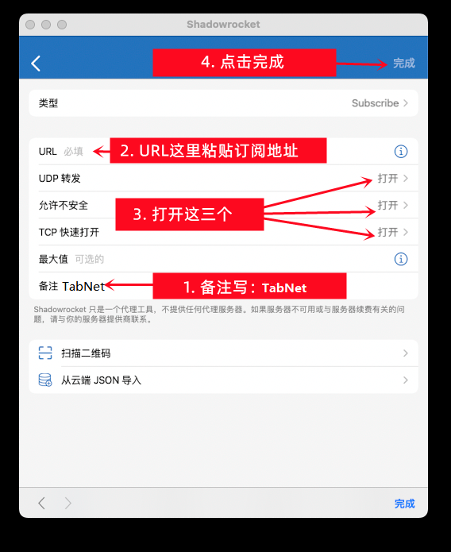<figcaption>
请按照图示操作
</figcaption></figure>

### 7. 启用自动更新

1. 打开 Shadowrocket **设置**
2. 找到 **订阅选项**
3. 开启以下功能：
   * ✅ 打开时更新
   * ✅ 自动后台更新

<figure>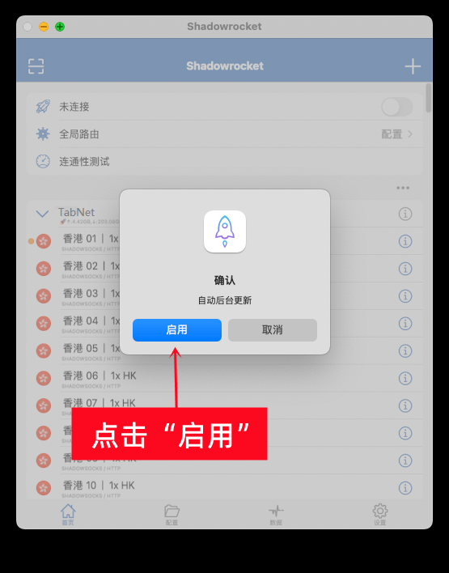<figcaption>
启用自动更新
</figcaption></figure>

### 8. 选择节点

1. 在主界面选择已导入的订阅节点
2. 点击目标节点进行切换

<figure>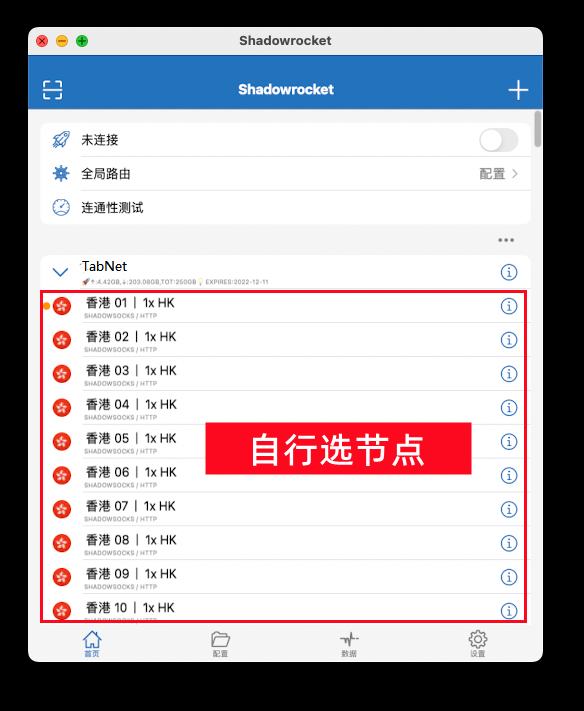<figcaption>
选择节点
</figcaption></figure>

### 9. 开始连接

1. 点击右上角开关，启动连接
2. 全局路由改为代理

<figure>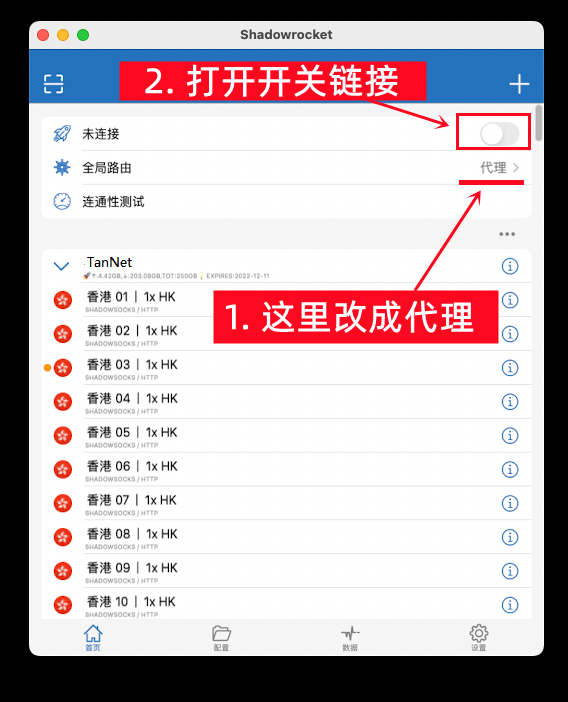<figcaption>
打开连接开关
</figcaption></figure>

3. 出现弹窗后，点好

<figure>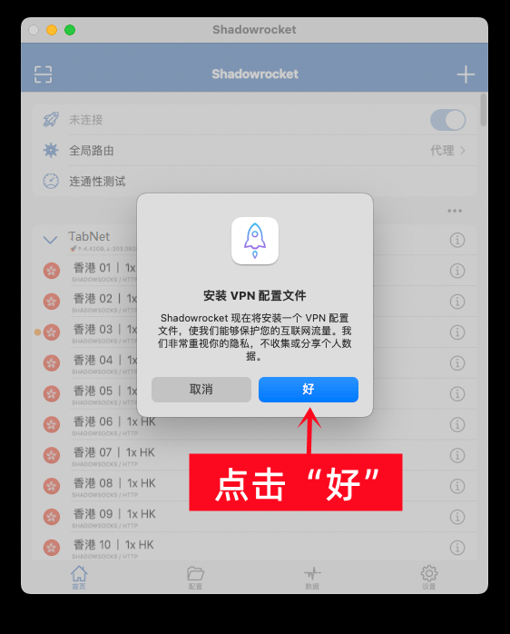<figcaption>
一定要点击 “好”否则无法连接
</figcaption></figure>

4. 出现系统弹窗时，点击 **允许**，添加 VPN 配置

<figure>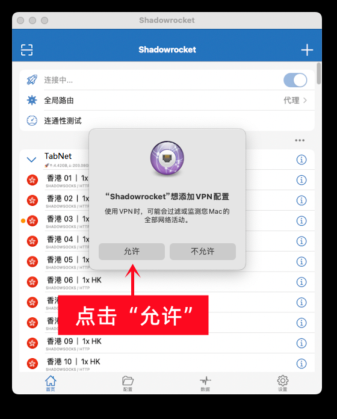<figcaption>
一定一定点击允许
</figcaption></figure>

5. 当开关点亮并显示节点名称时，即表示连接成功

<figure>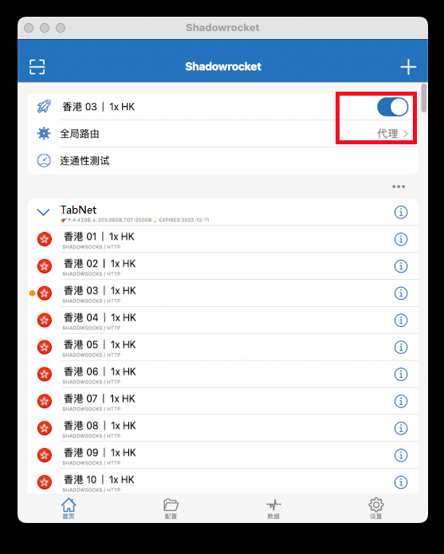<figcaption>
图示开关是打开状态
</figcaption></figure>

### 10. 测试连接

这样试着打开 [www.YouTube.com](http://www.youtube.com/) 测试一下，如果油管可以打开就说明已经成功

***

## 更新订阅教程


当节点失效时，可手动更新订阅。按照下方教程的操作即可实现手动更新订阅，获取最新节点！


1. 确保处于 **未连接状态**


当如果在连接状态下更新，可能会失败


2. 打开订阅管理，点击 **刷新按钮** 更新订阅
3. 如更新失败，请多次尝试

<figure><figcaption></figcaption></figure> <figure><figcaption></figcaption></figure>

***

## 重新配置教程


此教程教您如何删除旧的节点配置，重新获取新的节点配置！


1. 确保处于 **未连接状态**


当如果在连接状态下更新，可能会失败


2. 删除旧的订阅标签

<figure>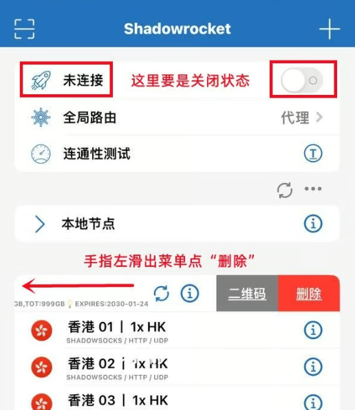<figcaption></figcaption></figure>

2. 重新导入订阅，参考 [#id-6.-dao-ru-ding-yue](m1-xin-pian-shadowrocket-shi-yong-jiao-cheng.md#id-6.-dao-ru-ding-yue "mention")
