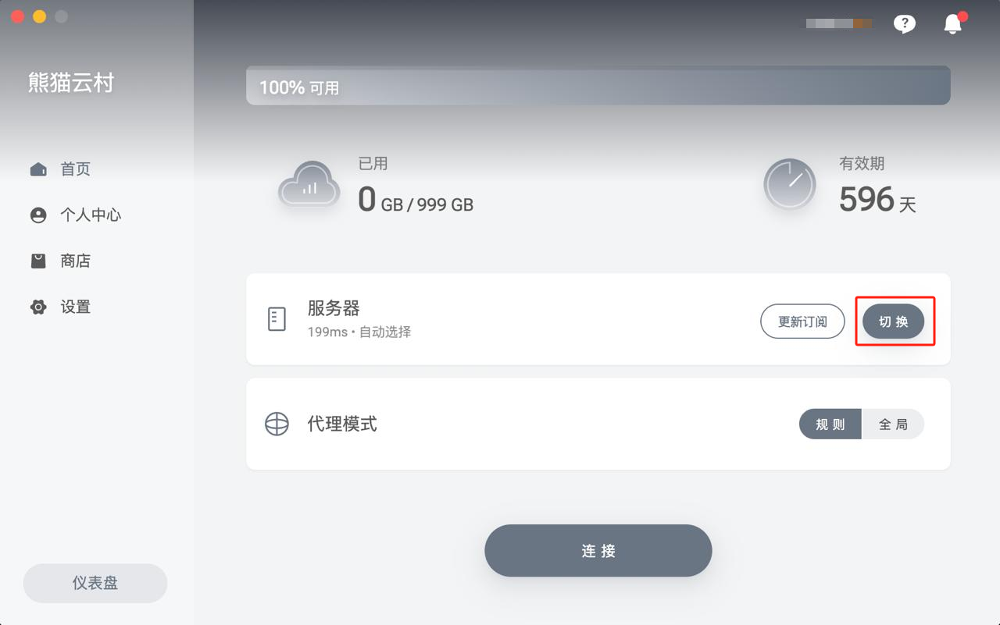
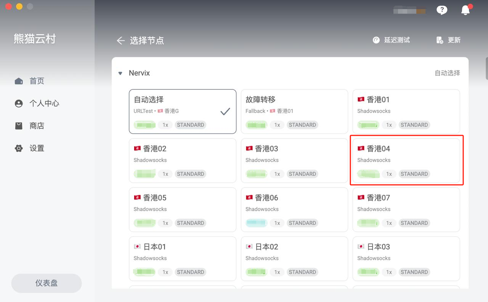
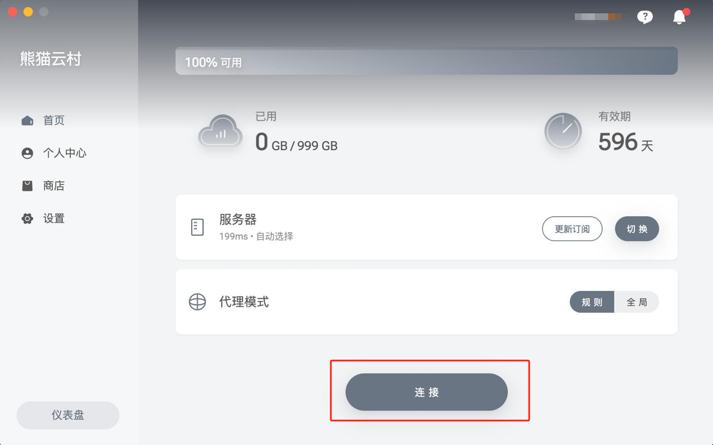

# 🖥️ TabNet for MacOS 下载与使用

### 1. 系统要求

* 支持 **MacOS 10 及以上版本**

### 2. TabNet 客户端下载（新客户端）

#### 如何查看mac是什么芯片

1. 鼠标点击屏幕左上角 **🍎 Apple 标志**
2. 点击 **「关于本机」**
3. 如果显示为 M1，2，3，4 芯片，则下载下方的M芯安装包，
4. 如果显示为 Intel，则下载intel芯片的安装包

<figure><figcaption>
请确认您的电脑是什么芯片
</figcaption></figure>


* [intel芯片 客户端下载](https://wwet.lanzoup.com/iG2vM2wy9cni) (免登录网盘，直接下载，见下图)
* [M芯 客户端下载 ](https://wwet.lanzoup.com/i0odj2wxyo2d)(免登录网盘，直接下载，见下图)
* [Intel芯片下载地址02](https://vault.digitalage.services/index.php/s/gcCgQ8Pa6K7S8M8)
* [M芯下载地址02](https://vault.digitalage.services/index.php/s/bzTCFbqdNSsNeEn)



如果安装的过程，系统提示不安全，无法打开，等情况，我们需要打开一个开启所有来源的开关，具体看教程👉 [mac-os-kai-qi-ren-he-lai-yuan-an-zhuang-quan-xian-jiao-cheng.md](../chang-jian-wen-ti/mac-os-kai-qi-ren-he-lai-yuan-an-zhuang-quan-xian-jiao-cheng.md "mention")


### 3. 安装说明


如果出现无法运行的提示，请按以下步骤操作：

1. 点击左上角 **苹果图标**
2. 打开 **系统设置 → 隐私与安全**
3. 下滑至页面底部，在安装提示处看到  **熊猫云村** 点击 **允许**


* 打开 **应用程序**
* 找到 **熊猫云村 App** 并点击运行

### 4. 登录界面

1. 打开客户端，输入您在 **熊猫云村（TabNet）注册的邮箱与密码**进行登录。

<figure><figcaption></figcaption></figure>

1. 登录成功后，点击切换可以跳转选择节点界面。

<figure><figcaption></figcaption></figure>

### 5.选择节点

* 登录成功后，点击 **切换** 进入节点选择界面
* 根据自身需求，手动选择合适的节点

<figure><figcaption></figcaption></figure>

### 6. 连接享受

1. 点击 **连接按钮**
2. 等待连接成功提示

<figure><figcaption></figcaption></figure>

### 7. 测试连接

连接后，可以打开 [www.youtube.com](http://www.youtube.com/) 测试一下，如果油管可以打开就说明已经成功
