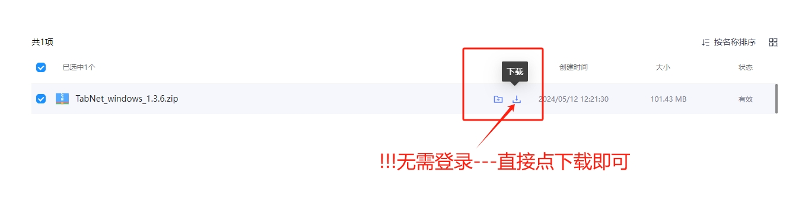

# 🖥️ TabNet for MacOS 下载与使用


**本教程适MacOS系统的电脑设备**


## TabNet客户端下载

* [Intel 客户端下载](https://wwet.lanzn.com/iUMu22ocfo7a) (免登录网盘，直接下载，见下图)
* [M芯 客户端下载](https://wwet.lanzn.com/iByDf2ocffmb) (免登录网盘，直接下载，见下图)
* [Intel下载地址02](https://vault.digitalage.services/index.php/s/gcCgQ8Pa6K7S8M8)
* [M芯下载地址02](https://vault.digitalage.services/index.php/s/bzTCFbqdNSsNeEn)

<figure><figcaption>
免登下载
</figcaption></figure>

* ~~老客户端下载（不分芯片，通用版本）~~

## [安装完软件，参考Windows步骤即可](../windows/tabnet-for-windows.md#deng-lu-jie-mian)
