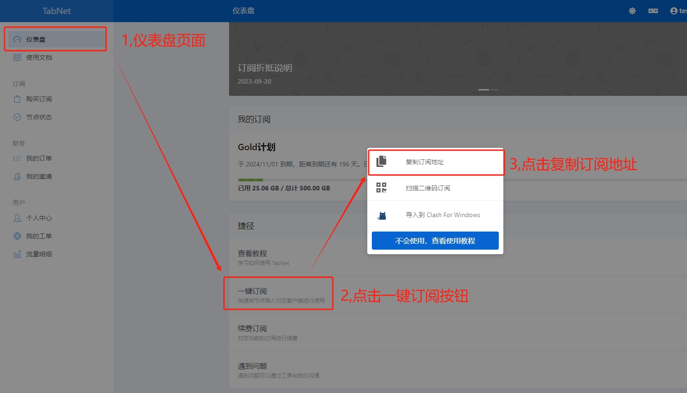

# 💻 Clash For Windows 使用教程


Clash 是一个使用 Go 语言编写，基于规则的跨平台代理软件核心程序。

该客户端仅支持Windows 10 以上系统



安装客户端前 请先 <mark style="color:red;">**关闭杀毒软件**</mark> 再安装。以免安装不完全导致无法正常使用。下载


### 应用下载

&#x20;网盘下载


&#x20;[网盘下载01](https://tagcloud.lanzouw.com/ibyth2hcivab)

[ 网盘下载02](https://share.feijipan.com/s/noDri8kk)

&#x20;[Gituhb仓库下载](https://github.com/clash-verge-rev/clash-verge-rev) (此仓库服务器位于海外，大陆部分地区可能需要搭配代理才能打开）


软件下载后为7z格式的压缩包，请直接解压后点击图标使用。

<figure><figcaption>
解压后的文件
</figcaption></figure>

### 开始使用


**tip:** 第一次使用会提示Windows安全中心警报，我们按照下方图示勾选即可。


<figure><figcaption>
请按照图示操作
</figcaption></figure>

### 导入订阅

首先回到 官网并登录：[https://hi.dmhosts.com](https://hi.dmhosts.com/)

复制订阅地址 如下图

<figure><figcaption>
请按照图示操作
</figcaption></figure>

粘贴到clash软件内并下载订阅文件(如更新错误，请多次尝试下载） 如下图

<figure><figcaption>
请安装图示操作
</figcaption></figure>

<figure><figcaption>
鼠标点击选中我们刚刚下载的订阅标签
</figcaption></figure>

### 选择节点

可根据自身需求手动选择节点。


ChatGPT（<mark style="color:red;">香港暂未支持</mark>） 请选择日本、美国、新加坡、韩国等其他国家。


<figure><figcaption>
在代理栏中选择节点
</figcaption></figure>

### 打开代理

<figure><figcaption>
请安图示操作
</figcaption></figure>

系统代理打开，链接成功后如下图所示

<figure><figcaption>
打开系统代理才可以正常访问外网
</figcaption></figure>

### 连接享受

连接后，可以打开 [www.youtube.com](http://www.youtube.com/) 测试一下，如果油管可以打开就说明已经成功
