# 💻 Clash For Windows 使用教程

## 目录

1. [#shi-yong-jiao-cheng](clash-for-windows.md#shi-yong-jiao-cheng "mention")
2. [#geng-xin-ding-yue-jiao-cheng](clash-for-windows.md#geng-xin-ding-yue-jiao-cheng "mention")
3. [#zhong-zhi-pei-zhi-jiao-cheng](clash-for-windows.md#zhong-zhi-pei-zhi-jiao-cheng "mention")


点击上方目录即可跳转


***

## 使用教程

### 1. 系统要求


Clash 是一个使用 Go 语言编写，基于规则的跨平台代理软件核心程序。

该客户端仅支持Windows 10 以上系统



安装客户端前 请先 <mark style="color:red;">**关闭杀毒软件**</mark> 再安装。以免安装不完全导致无法正常使用。下载


### 2. 应用下载

&#x20;网盘下载


[ 网盘下载01](https://tagcloud.lanzouw.com/iFwJP2xy3eah)

[ 网盘下载02](https://share.feijipan.com/s/noDri8kk)

[ 网盘下载03](https://yunkeyso.oss-cn-hongkong.aliyuncs.com/khd/yd/yd-clash-win.zip)

&#x20;[Gituhb仓库下载](https://github.com/clash-verge-rev/clash-verge-rev) (此仓库服务器位于海外，大陆部分地区可能需要搭配代理才能打开）


软件下载后为7z格式的压缩包，请直接解压后点击图标使用。

<figure>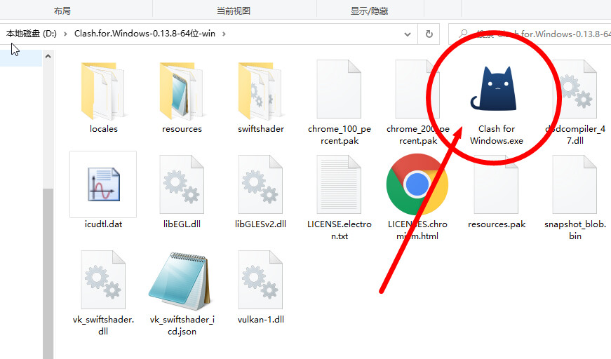<figcaption>
解压后的文件
</figcaption></figure>

### 3. 首次运行


第一次使用会提示Windows安全中心警报，我们按照下方图示勾选即可。


<figure>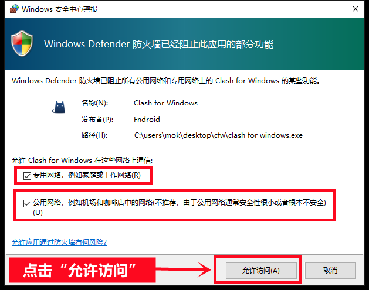<figcaption>
请按照图示操作
</figcaption></figure>


如未勾选，可能导致程序无法正常联网


### 4. 导入订阅

首先回到 官网并登录：[https://hi.dmhosts.com](https://hi.dmhosts.com/)

Clash 支持两种方式导入订阅  [#shou-dong-dao-ru](clash-for-windows.md#shou-dong-dao-ru "mention") 和 [#yi-jian-dao-ru](clash-for-windows.md#yi-jian-dao-ru "mention")

#### 🔹 手动导入

1. 复制个人订阅地址

<figure><figcaption>
请按照图示操作
</figcaption></figure>

2. 粘贴到clash软件内并下载订阅文件(如更新错误，请多次尝试下载） 如下图

<figure>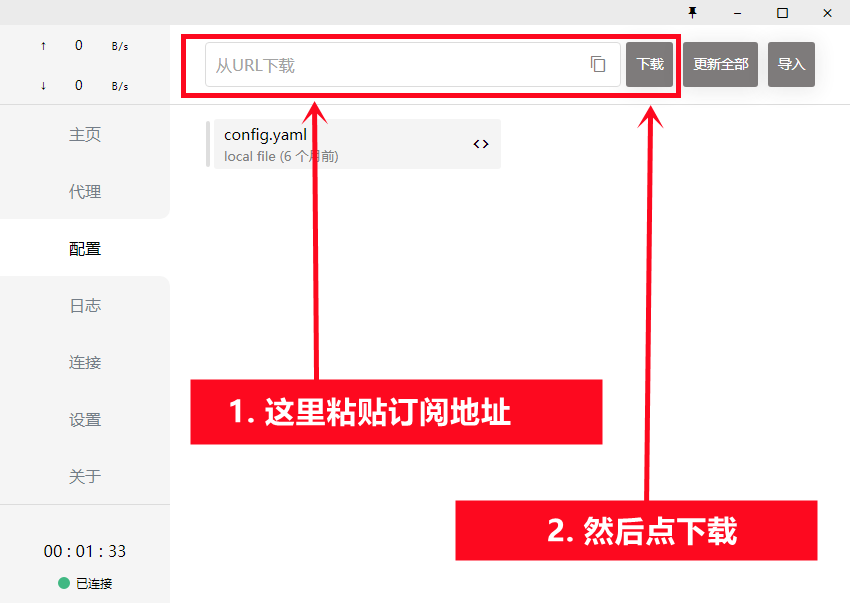<figcaption>
请安装图示操作
</figcaption></figure>


如果下载配置文件出现 **`Network Error`**：

1. 请回到官网刷新页面后重新复制地址（网站提供 3 个可用地址）
2. 或更换网络环境（例如使用手机 4G/5G 热点）


3. 鼠标点击选中刚刚下载的订阅标签

<figure>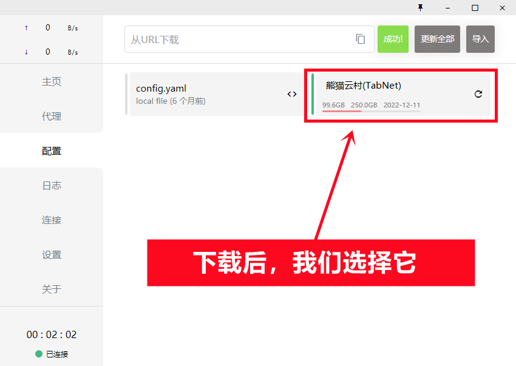<figcaption>
鼠标点击选中我们刚刚下载的订阅标签
</figcaption></figure>

#### 🔹 一键导入

1. 选中下方图片的选项即可自动跳转到clash，**之后请重复上方的第三步骤，选中新订阅标签**

<figure><figcaption></figcaption></figure>

2. 导入成功的后，会出现上方一样的订阅标签


如果下载配置文件出现 **`Network Error`**：

1. 请回到官网刷新页面后重新复制地址（网站提供 3 个可用地址）
2. 或更换网络环境（例如使用手机 4G/5G 热点）


### 5. 选择节点

可根据自身需求手动选择节点。


ChatGPT（<mark style="color:red;">香港暂未支持</mark>） 请选择日本、美国、新加坡、韩国等其他国家。


<figure>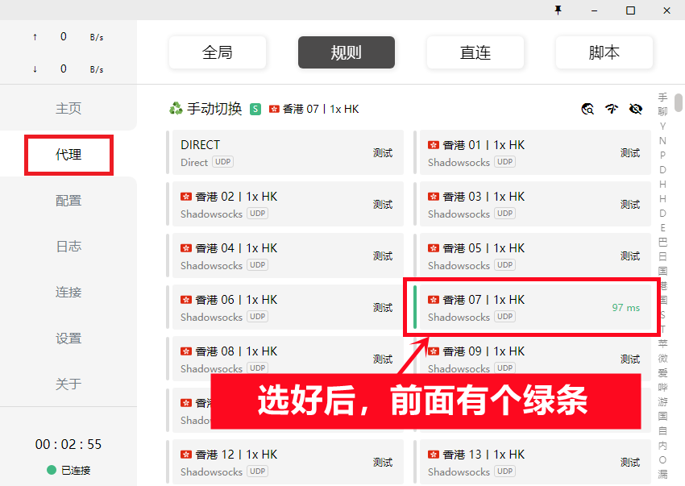<figcaption>
在代理栏中选择节点
</figcaption></figure>

### 6. 开启系统代理

<figure>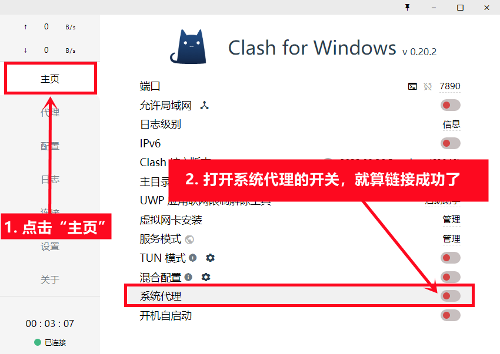<figcaption>
请安图示操作
</figcaption></figure>

### 7. 系统代理打开，链接成功后如下图所示

<figure>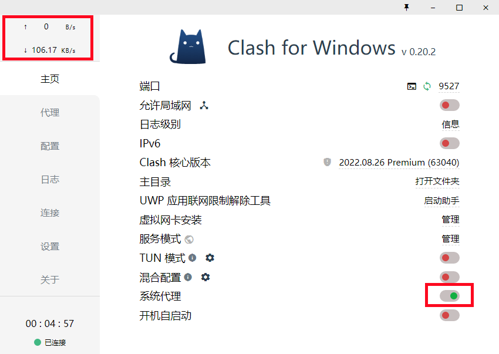<figcaption>
打开系统代理才可以正常访问外网
</figcaption></figure>

连接后，可以打开 [www.youtube.com](http://www.youtube.com/) 测试一下，如果油管可以打开就说明已经成功

***

## 更新订阅教程


按照下方教程的操作即可实现手动更新订阅，获取最新节点信息


1. 确保当前处于 **未连接状态**


更新订阅时一定要是未连接状态，如果是链接状态可能会更新失败


<figure>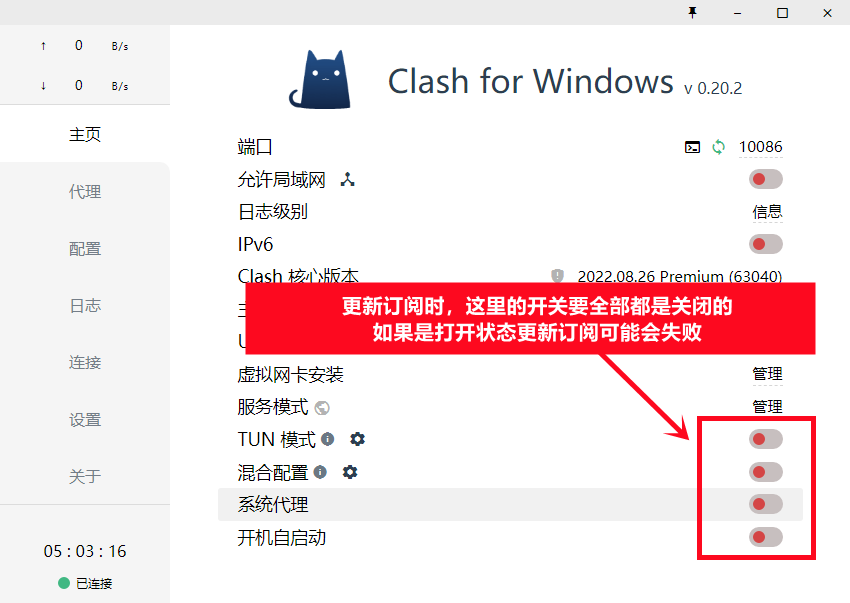<figcaption>
红框捏按钮全部关闭
</figcaption></figure>

2. 打开 Clash 界面，进入 **「配置（Profiles）」** 页面
3. 找到需要更新的配置文件，点击右侧的 **刷新按钮** 更新订阅


如更新失败，请多尝试几次


<figure>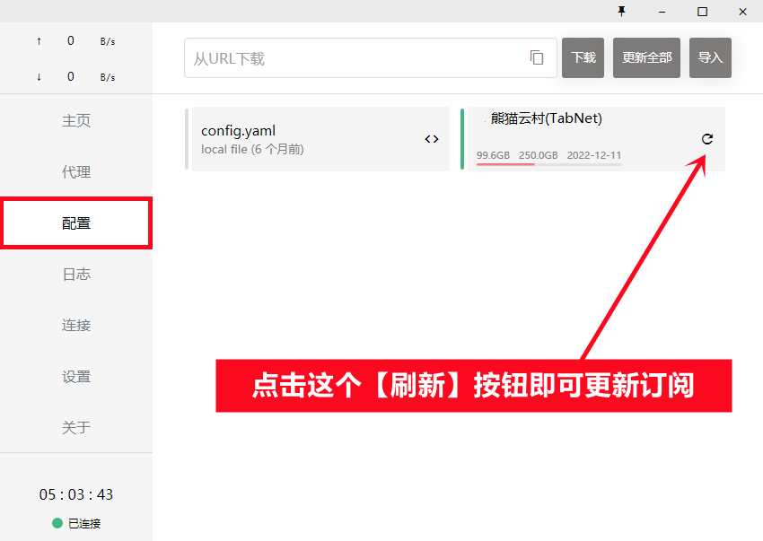<figcaption>
更新即可
</figcaption></figure>

***

## 重置配置教程


此教程教您如何删除旧的节点配置，重新获取新的节点配置！


1. 确保当前处于 **未连接状态**


先关闭系统代理，如果本身是关闭的就忽略这一步


<figure>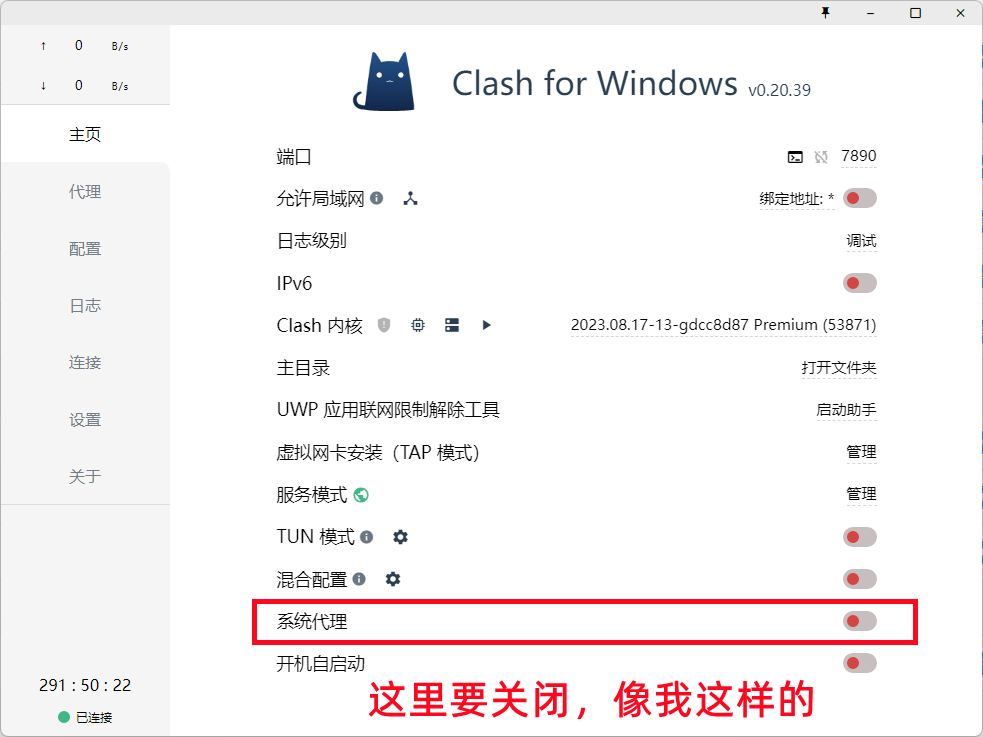<figcaption>
请务必关闭代理
</figcaption></figure>

2. 回到 官网并登录：[https://hi.dmhosts.com](https://hi.dmhosts.com/)复制订阅地址 如下图

<figure><figcaption>
请按照图示操作
</figcaption></figure>

3. 回到 Clash 软件，删除旧的订阅标签
4. 重新添加新的订阅地址并下载配置文件

<figure>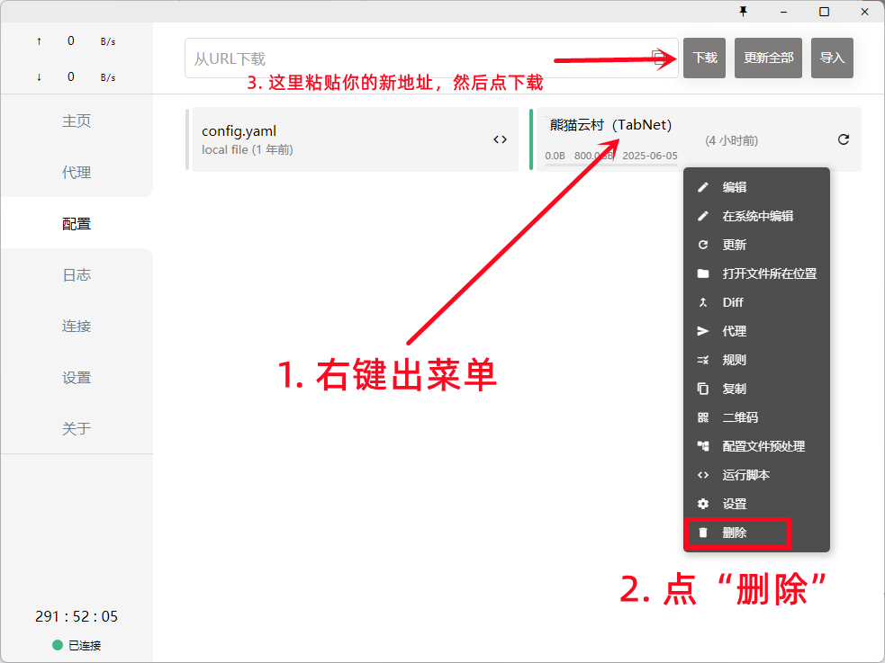<figcaption>
先删除老的订阅标签，再重新下载新的订阅
</figcaption></figure>


如果下载配置文件出现 **`Network Error`**：

1. 请回到官网刷新页面后重新复制地址（网站提供 3 个可用地址）
2. 或更换网络环境（例如使用手机 4G/5G 热点）

