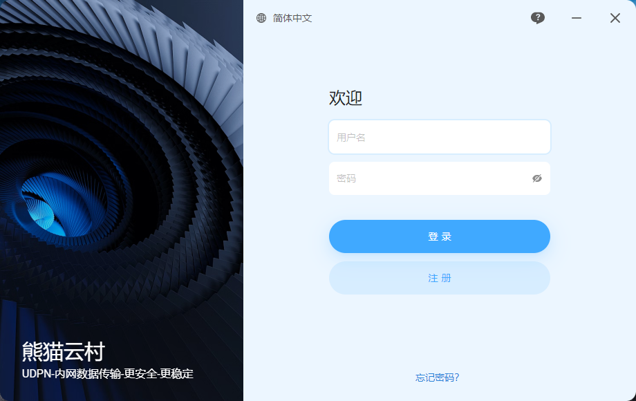
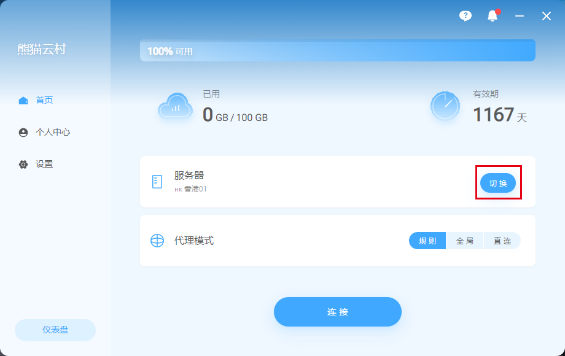
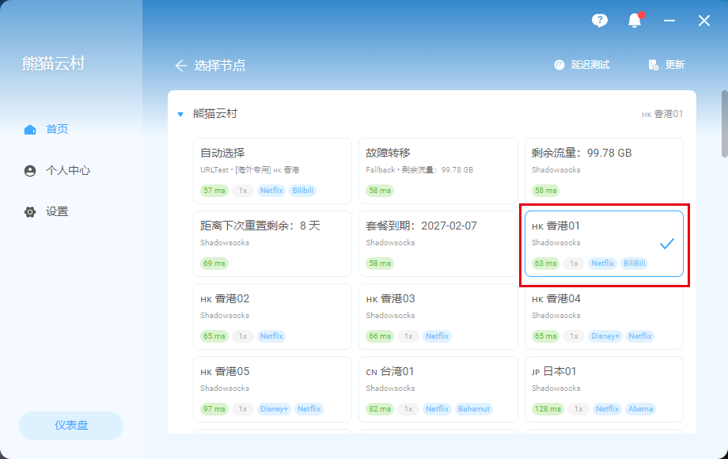
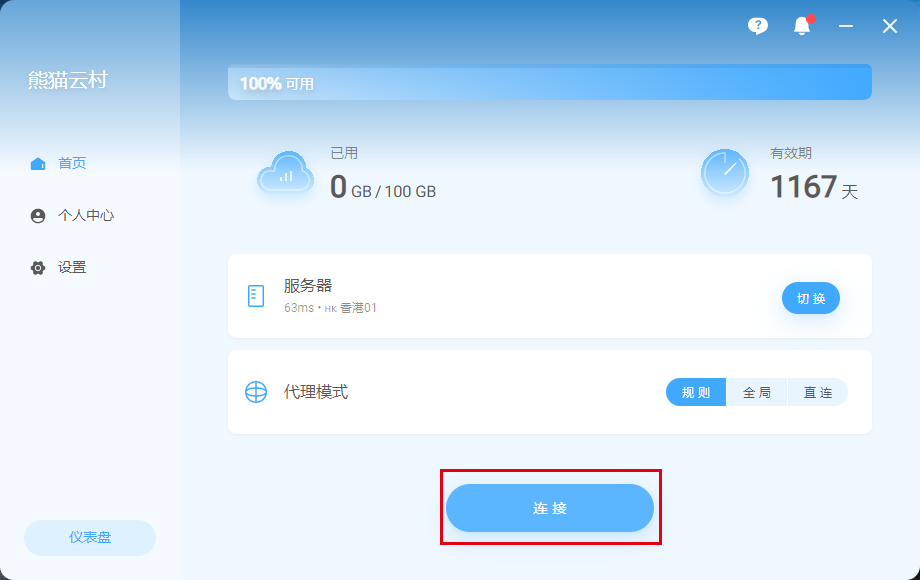

# 💻 TabNet For Windows 定制客户端使用教程


**本教程适用于Windows系统的设备**


## TabNet 客户端下载（新客户端）


安装客户端前 请先 <mark style="color:red;">**关闭杀毒软件**</mark> 再安装。以免安装不完全导致无法正常使用。


* 👉[网盘下载](https://www.123pan.com/s/Psbbjv-mBdVd.html)--网盘免登录，可直接下载

网盘下载如下图（<mark style="color:green;">鼠标移动到文件上就会出现箭头地方的下载按钮</mark>）

<figure><figcaption>
免登录下载
</figcaption></figure>

* ~~👉~~[~~直连点击下载~~](https://alidrive.duomi.host/d/alipan/Client/windows/TabNet_windows_1.3.2.zip?sign=y3gERK-bPoOMj-0ykA1BIJc7aKvauFqGeAuLlQ1dwdM=:0)

### 登录界面

输入您在 熊猫云村（TabNet） 注册的邮箱跟密码登录。


**tip:** 正确安装后，左下角出现 熊猫云村 与副标题，如未出现，关闭杀毒软件重新安装即可。


### 开始使用

登录成功后，点击切换可以跳转选择节点界面。

### 选择节点

可根据自身需求手动选择节点。


ChatGPT（<mark style="color:red;">香港暂未支持</mark>） 请选择日本、美国、新加坡、韩国等其他国家。


<figure><figcaption>
手动切换节点界面
</figcaption></figure>

### 连接享受

点击连接按钮 即可享受丝滑的网络体验。

连接后，可以打开 [www.YouTube.com](http://www.youtube.com/) 测试一下，如果油管可以打开就说明已经成功
