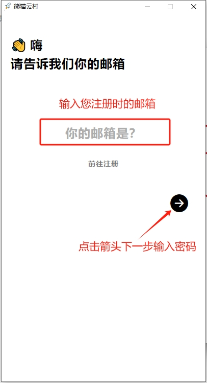
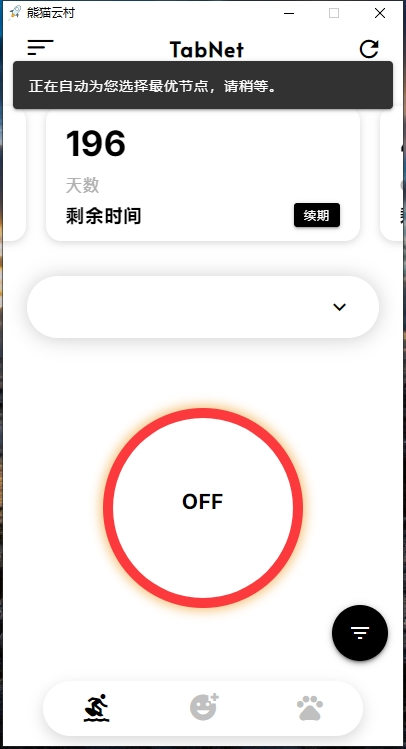
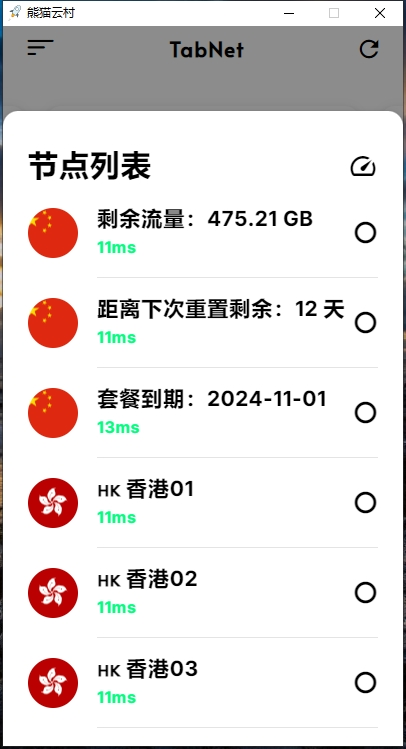
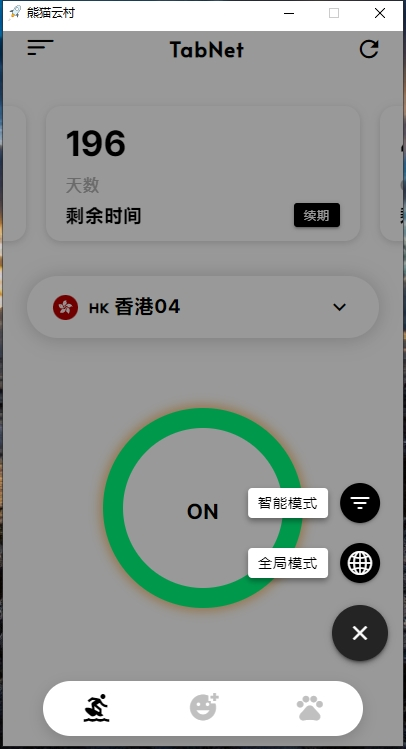

# 💻 熊猫云村 For Windows 定制客户端使用教程


**本教程适用于Windows系统的设备**


## 熊猫云村 客户端下载（老客户端）


安装客户端前 请先 <mark style="color:red;">**关闭杀毒软件**</mark> 再安装。以免安装不完全导致无法正常使用。


* 👉[网盘下载 ](https://xmyc.lanzout.com/i5HDx1r16sih)

软件下载后，打开安装，安装完毕后会在桌面生成快捷方式。打开后登录账号即可使用

### 登录使用

输入您在 熊猫云村（TabNet）注册的邮箱跟密码登录。


**tip:** 登录后软件会自动为您选择最优的节点，并且会直接把代理打开，这时您就可以直接使用了。期间可能会耗时10-20s，请耐心等待。



&#x20;<mark style="background-color:red;">OFF</mark> 为关闭代理状态，外框呈红色； <mark style="background-color:green;">ON</mark> 为打开代理状态，外框呈绿色。


<figure><figcaption>
账号登录界面
</figcaption></figure> <figure><figcaption>
订阅更新过程中...
</figcaption></figure>

### 选择节点


Tip: ChatGPT（<mark style="color:red;">香港暂未支持</mark>） 请选择日本、美国、新加坡、韩国等其他国家。


<figure><figcaption>
可以手动点击选择节点
</figcaption></figure> <figure><figcaption>
模式可选 全局或智能
</figcaption></figure>


智能模式：属于国内直连，国外自动走节点流量（建议使用）

全局模式：全部国内国外都走节点流量（有可能导致访问国内比较卡）


### 连接享受

连接后，可以打开 [www.YouTube.com](http://www.youtube.com/) 测试一下，如果油管可以打开就说明已经成功。
